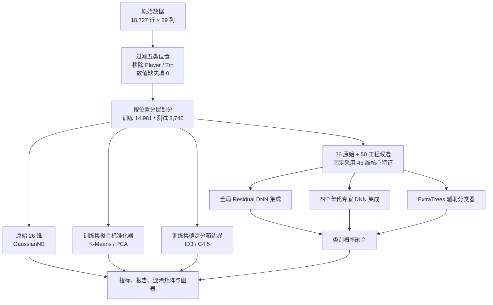
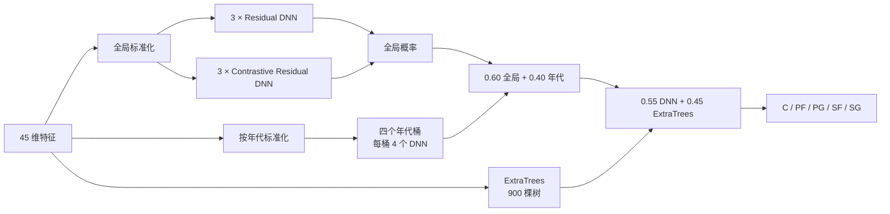

# NBA 球员位置预测：从基础算法到深度学习融合

**中文** · [English](README_EN.md) · [完整实验报告](大数据技术实验_综合实验报告.md)

根据球员单赛季技术统计，预测数据集标注的五个场上位置：中锋 C、大前锋 PF、控球后卫 PG、小前锋 SF、得分后卫 SG。项目从统一预处理出发，实现了高斯朴素贝叶斯、K-Means、手写 ID3、手写 C4.5 四项基础实验，并进一步完成特征工程、Residual DNN 集成、监督对比学习、年代专家、ExtraTrees 概率融合、特征子集比较和九组消融实验。

## 目录

- [任务与整体流程](#任务与整体流程)
- [数据与预处理](#数据与预处理)
- [五项实验如何实现](#五项实验如何实现)
- [深度学习方案详解](#深度学习方案详解)
- [结果与分析](#结果与分析)
- [特征子集与消融实验](#特征子集与消融实验)
- [安装、运行与产物](#安装运行与产物)

## 任务与整体流程

输入是一个球员某赛季的 26 个数值统计字段；监督学习目标是 `Pos ∈ {C, PF, PG, SF, SG}`。`Player` 和 `Tm` 不进入模型。前四项实验提供基础方法与对照；第五项使用特征工程和多模型融合。



## 数据与预处理

仓库根目录已包含 `NBA_Season_Stats.csv`，共有 **1980–2017 年、18,727 条球员赛季记录和 29 列**。五类样本数：C 3,765、PF 3,945、PG 3,753、SF 3,572、SG 3,692。克隆仓库后即可直接运行预处理和实验。

预期列名：`Year, Player, Pos, Age, Tm, G, MP, FG, FGA, FG%, 3P, 3PA, 3P%, 2P, 2PA, 2P%, eFG%, FT, FTA, FT%, ORB, DRB, TRB, AST, STL, BLK, TOV, PF, PTS`。

| 步骤 | 具体做法 | 生成内容 |
| --- | --- | --- |
| 清洗 | 只保留五类 `Pos`；不把 `Player`、`Tm` 用作特征；26 个数值特征转为数值类型，缺失填 0 | `nba_clean*.csv` |
| 划分 | `random_state=42`，按 `Pos` 分层，80% 训练 / 20% 测试 | 14,981 / 3,746 行 |
| 标准化 | `StandardScaler` 只在训练集拟合，再转换训练、测试和全量数据 | `nba_scaled*.csv` |
| 离散化 | 根据**训练集**分位数确定最多三档 `low/mid/high`，重复边界合并 | `nba_discrete*.csv` |
| 元数据 | 保存特征名、标签映射、数据规模和填补统计 | `feature_columns.txt`、`label_mapping.json`、`preprocess_report.json` |

主要缺失值出现在命中率列：`FG%` 88、`3P%` 3,485、`2P%` 117、`eFG%` 88、`FT%` 742 条。监督模型共享同一训练/测试划分；K-Means 使用标准化后的全量样本进行无监督探索，并在训练后用真实标签解释聚类。

## 五项实验如何实现

| 实验 | 输入与核心方法 | 完成的分析与产物 |
| --- | --- | --- |
| 1. Gaussian Naive Bayes | 26 个清洗后的连续特征，`sklearn.naive_bayes.GaussianNB` | 测试集预测、逐类 Precision/Recall/F1、分类报告、混淆矩阵及类别分布图 |
| 2. K-Means | 26 个标准化特征；主实验固定 `k=5`、`n_init=10`、种子 42 | `k=2…10` 肘部/轮廓曲线；ARI、NMI、同质性、簇多数类映射；PCA 投影及簇×位置热力图 |
| 3. ID3 | 26 个离散化特征；自行递归实现**信息增益**选特征 | 树 JSON、IF/THEN 规则、特征使用次数、树规模、预测与分类图表 |
| 4. C4.5 | 相同离散化特征；自行递归实现**信息增益率**选特征 | 同样输出树结构、规则与图表；保留基础版，未做剪枝、参数搜索或集成 |
| 5. 深度学习融合 | 45 个筛选特征；DNN、年代专家和 ExtraTrees | 配置验证、训练曲线、模型权重、概率预测、逐类分析、特征搜索和九组消融 |

ID3 与 C4.5 遇到测试样本中未见过的分支值时，回退到当前节点的训练集多数类别。两者输出可读规则，便于检查分类依据；离散化也会损失部分连续数值信息。


## 深度学习方案详解

### 1. 从 76 个候选特征到固定的 45 维输入

代码在 26 个原始数值字段之外构造 50 个工程特征；正式脚本的 `SELECTED_FEATURES` 固定为 45 维，其中 **17 个原始字段 + 28 个工程字段**。原项目另保留九组紧凑特征子集的历史搜索结果；搜索流程没有作为独立可运行脚本提交。最终输入的**全部 45 个字段**如下：

| 分组 | 字段 | 作用 |
| --- | --- | --- |
| 原始统计（17） | `Year`, `Age`, `G`, `MP`, `FG%`, `3P%`, `2P%`, `eFG%`, `FT%`, `ORB`, `DRB`, `TRB`, `AST`, `STL`, `BLK`, `TOV`, `PF` | 年代、出场、投篮效率、篮板、组织与防守 |
| 场均统计（8） | `PPG`, `MPG`, `RPG`, `APG`, `SPG`, `BPG`, `TPG`, `FPG` | 用总量除以场次，降低出场场数的影响 |
| 比例与效率（5） | `ThreePAr`, `FTr`, `AST_TOV`, `ORB_Ratio`, `DRB_Ratio` | 投篮结构、组织效率、篮板构成 |
| 每 36 分钟（10） | `PTS_36`, `TRB_36`, `AST_36`, `STL_36`, `BLK_36`, `PF_36`, `3PA_36`, `FTA_36`, `ORB_36`, `DRB_36` | 在相近上场时间尺度下比较产出 |
| 位置画像与分离（5） | `Heightless_Big_Profile`, `Primary_Guard_Profile`, `Center_PF_Separation`, `SG_PG_Separation`, `SF_PF_Separation` | 将内线、后卫及相邻位置差异表达为组合特征 |

例如 `PPG = PTS/G`、`ThreePAr = 3PA/FGA`、`PTS_36 = 36×PTS/MP`。`Center_PF_Separation = BLK_36 + ORB_36 + FTr − 3PA_36`，组合了内线防守、前场篮板、造罚球与外线出手。代码对零分母和无穷值统一处理为 0。`Year` 也参与年代分桶，但模型不使用姓名或球队。


### 2. 验证、训练与概率融合

1. 在 14,981 条训练记录中再按位置分层划出 11,984 条训练子集和 2,997 条验证子集。标准化器只在对应训练部分拟合。首先比较三种普通全连接网络配置，以验证集 Macro F1 选择配置并使用早停（最多 140 轮，耐心值 22）。最佳记录为 `[256, 128, 64]`、Dropout 0.20、学习率 0.001，最佳轮数 70、验证 Macro F1 0.6899。这一配置比较与后续正式残差集成是两个阶段。
2. 正式全局模型使用 45 维输入、宽度 192、两个残差块、Dropout 0.15。3 个普通 Residual DNN 分别以种子 42、7、2026 训练 100 轮；3 个 Contrastive Residual DNN 用同样种子训练 110 轮。六个成员的类别概率等权平均。
3. Contrastive 成员在带 0.02 label smoothing 的交叉熵之外，加入权重 0.10、温度 0.20 的监督对比损失。训练采用 batch size 512、AdamW 和余弦学习率调度。
4. 按 `Year` 分为 `<1990`、`1990–1999`、`2000–2009`、`≥2010` 四个年代。每个年代各训练 2 个普通残差网络和 2 个 Contrastive 网络，每个成员 120 轮；四个概率等权平均。年代专家只处理对应年代的测试行。
5. 全局与年代专家概率按 **0.60 : 0.40** 融合。再训练 `ExtraTreesClassifier`（900 棵树，`max_features=0.70`、`min_samples_leaf=3`、类别平衡权重），最后计算 **0.55 × DNN 概率 + 0.45 × ExtraTrees 概率**，取最大概率的位置。




## 结果与分析

| 方法 | 输入维度 | Accuracy | Macro F1 | Weighted F1 | 说明 |
| --- | ---: | ---: | ---: | ---: | --- |
| Gaussian Naive Bayes | 26 | 0.4477 | 0.4027 | 0.4019 | 已复测 |
| K-Means | 26 | — | — | — | 见下方聚类指标 |
| ID3 | 26 | 0.4357 | 0.4360 | 0.4362 | 已复测 |
| C4.5 | 26 | 0.4327 | 0.4328 | 0.4332 | 已复测 |
| DNN + 概率融合 | 45 | **0.7261** | **0.7258** | **0.7259** | 原项目训练结果 |

K-Means 在 `k=5` 时的轮廓系数为 **0.2070**、ARI **0.0166**、NMI **0.0509**、同质性 **0.0476**、事后多数类映射准确率 **0.2519**。`k=2` 的轮廓系数更高（0.3524），但主实验固定五簇以对应五类位置；统计空间中的自然簇并不自动等于位置标签。


手写 ID3 树有 **11,846 个节点 / 6,727 个叶节点 / 最大深度 19**；C4.5 为 **11,802 / 6,638 / 26**。两棵树没有剪枝，规模较大。朴素贝叶斯的 C、PG 召回较高，但 PF、SF、SG 较弱；两种树的 Macro F1 接近 0.43。


最终融合模型的逐类指标：

| 位置 | Precision | Recall | F1 |
| --- | ---: | ---: | ---: |
| C | 0.7653 | 0.7450 | 0.7550 |
| PF | 0.6574 | 0.6591 | 0.6582 |
| PG | 0.8505 | 0.8708 | **0.8605** |
| SF | 0.6583 | 0.6583 | 0.6583 |
| SG | 0.6969 | 0.6969 | 0.6969 |

PG 最容易识别；PF、SF、SG 的边界仍模糊。真实 C 被判为 PF 有 162 例，PF 被判为 C 有 148 例；真实 SF 被判为 SG 有 118 例，SG 被判为 SF 也有 118 例；PG/SG 间也有双向混淆。


### 原项目还做了哪些探索

- **特征筛选：** 保留了 26 原始 + 50 工程候选、重要性 Top-k、领域紧凑集、位置分离核心集的历史比较。正式代码固定使用 45 维配置；历史搜索结果不是当前脚本自动生成的。
- **网络配置验证：** 对比三种普通 DNN 隐藏层配置，保存验证曲线、最佳轮数和验证集指标。
- **融合权重探查：** 保存 DNN/年代专家/ExtraTrees 不同权重的历史记录；最终脚本使用上文固定权重。
- **层级分类探查：** 保留先分大类再细分、以及多任务层级预测的试验表。它们是历史探索记录，未纳入当前正式推理流程。
- **报告与汇报：** 原项目生成完整课程报告、逐实验报告、预测明细、树规则、模型权重和五种幻灯片版本。仓库收录原始数据、代码、综合报告及其引用的 28 张图；模型权重、预测明细和 PPT 可按需在本地生成。

## 特征子集与消融实验

下表是原项目保存的**九组完整方案特征子集比较**，展示输入维度与对应结果。

| 特征集 | 维度 | Accuracy | Macro F1 |
| --- | ---: | ---: | ---: |
| `separation_core_45` | 45 | **0.7261** | **0.7258** |
| `separation_plus_all_profiles_54` | 54 | 0.7226 | 0.7227 |
| `separation_plus_usage_52` | 52 | 0.7205 | 0.7202 |
| `separation_plus_indices_50` | 50 | 0.7192 | 0.7190 |
| `domain_compact_42` | 42 | 0.7173 | 0.7170 |
| `importance_top_35` | 35 | 0.7157 | 0.7158 |
| `domain_compact_36` | 36 | 0.7114 | 0.7114 |
| `importance_top_30` | 30 | 0.7117 | 0.7113 |
| `profile_core_32` | 32 | 0.7058 | 0.7057 |

九组消融以 A0 完整方案为参照；下降量是 `A0 Macro F1 − 当前变体 Macro F1`。A0、A6、A8 可由正式实验五输出复制或推导，其他变体分别训练。

| 版本 | 改动 | Macro F1 | 较 A0 下降 |
| --- | --- | ---: | ---: |
| A0 | 完整方案 | **0.7258** | — |
| A1 | 使用全部 76 个候选特征 | 0.7212 | 0.0046 |
| A2 | 只用 26 个原始特征 | 0.7032 | 0.0226 |
| A3 | 去掉监督对比损失 | 0.7225 | 0.0033 |
| A4 | 去掉 Contrastive DNN 成员 | 0.7209 | 0.0049 |
| A5 | 去掉年代专家 | 0.7107 | 0.0151 |
| A6 | 去掉 ExtraTrees 融合 | 0.7167 | 0.0091 |
| A7 | 退化为单个普通残差 DNN | 0.6972 | 0.0286 |
| A8 | 只用 ExtraTrees | 0.6899 | 0.0359 |

消融结果显示，工程特征、DNN 集成和年代专家对该方案的影响较大。


## 安装、运行与产物

建议 Python 3.11。核心依赖见 `requirements.txt`：NumPy、pandas、scikit-learn、Matplotlib、PyTorch、tabulate；幻灯片脚本另需 `requirements-ppt.txt` 中的 python-pptx 和 Pillow。GPU 可加快 DNN 训练，代码也能选择 CPU。原项目记录使用 CUDA 和 NVIDIA GeForce RTX 4060 Laptop GPU；不同环境的训练时间及结果可能变化。

```bash
git clone https://github.com/LRZer/nba-player-position-prediction.git
cd nba-player-position-prediction
python -m pip install -r requirements.txt
```

数据文件已经位于仓库根目录，按顺序运行：

```bash
python scripts/preprocess_nba.py
python experiments/experiment1_bayes.py
python experiments/experiment2_kmeans.py
python experiments/experiment3_id3.py
python experiments/experiment4_c45.py
python experiments/experiment5_dnn.py
python experiments/experiment5_ablation.py
```

`experiment5_dnn.py` 训练多组全局及年代网络，耗时明显高于其他实验。`experiment5_ablation.py` 默认复用已存在的变体 `metrics.json`；需要重新训练时可加 `--force`，并先完成实验五。

| 路径 | 内容 | GitHub 收录情况 |
| --- | --- | --- |
| `processed/` | 清洗、标准化、离散化的全量/训练/测试 CSV 共 9 份；特征名、标签映射、预处理报告 | 生成后留在本地 |
| `results/experiment1_bayes/` | 指标、分类报告、预测、混淆矩阵、逐类指标、分布图 | 报告引用的图已收录 |
| `results/experiment2_kmeans/` | k 值搜索、簇归属/统计、交叉表、PCA 投影及相关图 | 报告引用的图已收录 |
| `results/experiment3_id3/`、`experiment4_c45/` | 指标、树 JSON、文字规则、特征使用、预测和图表 | 报告引用的图已收录 |
| `results/experiment5_dnn/` | 验证、训练、逐类预测、45 维特征、权重、图表及额外探查记录 | 报告引用的图已收录 |
| `results/experiment5_feature_selection_search/` | 九组历史特征子集结果、预测、图表和专项报告 | 报告引用的图已收录；搜索脚本未收录 |
| `results/experiment5_ablation/` | A0–A8 指标、预测、汇总表、报告和图表 | 报告引用的图已收录 |
| `scripts/generate_*_ppt.py` | 五个可选汇报生成脚本，读取已有实验结果 | 脚本已收录；PPT 未收录 |

如需生成 PPT，先安装 `requirements-ppt.txt`，运行相应实验以生成 JSON、CSV 和图表，再执行所需的 `scripts/generate_*_ppt.py`。综合展示脚本在模板文件不存在时会创建空白幻灯片。

| 可选脚本 | 生成的幻灯片 |
| --- | --- |
| `generate_deep_learning_ppt.py` | `NBA_position_deep_learning_report.pptx` |
| `generate_academic_deep_learning_ppt.py` | `NBA_position_deep_learning_academic_report.pptx` |
| `generate_deep_learning_design_ppt.py` | `NBA_position_deep_learning_design_report.pptx` |
| `generate_deep_learning_teaching_ppt.py` | `NBA_position_deep_learning_teaching_report.pptx` |
| `generate_bigdata_experiment_ppt.py` | `大数据技术实验_深度学习模型汇报.pptx` |
