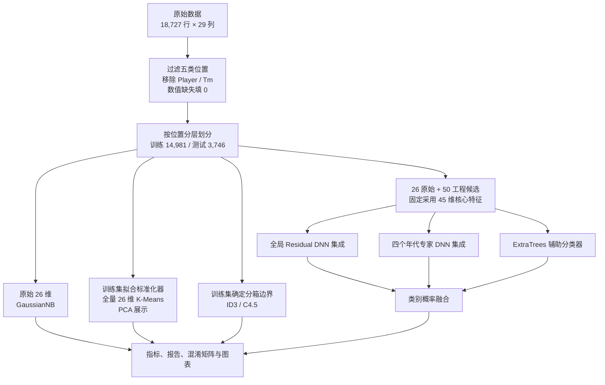
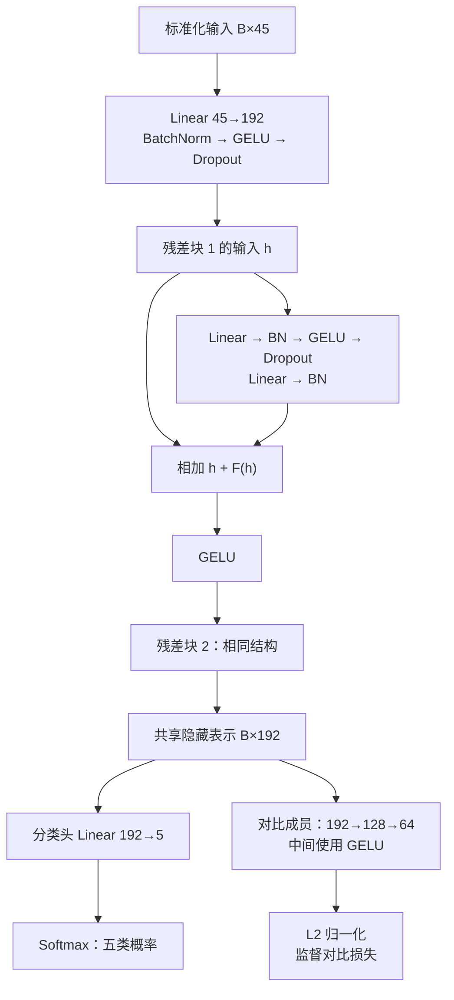
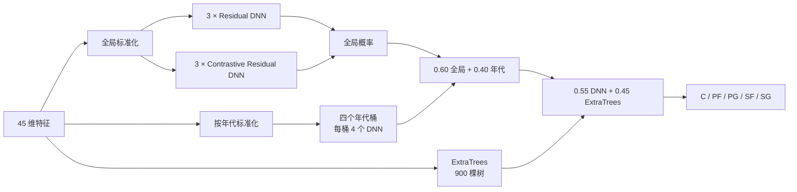

# NBA 球员位置预测：从基础算法到深度学习融合

**中文** · [English](README_EN.md) · [完整实验报告](大数据技术实验_综合实验报告.md)

根据球员单赛季技术统计，预测数据集标注的五个场上位置：中锋 C、大前锋 PF、控球后卫 PG、小前锋 SF、得分后卫 SG。项目从统一预处理出发，实现了高斯朴素贝叶斯、K-Means、手写 ID3、手写 C4.5 四项基础实验，并进一步完成特征工程、Residual DNN 集成、监督对比学习、年代专家、ExtraTrees 概率融合、特征子集比较和九组消融实验。

直观地说，模型通过得分、篮板、助攻、盖帽和投篮方式等统计，判断一条球员赛季记录更像哪种位置。最终方案让多个神经网络和一个树集成模型分别给出五类位置的概率，再合并判断。原项目记录的最终测试集 **Accuracy 为 72.61%，Macro F1 为 0.7258**。

## 目录

- [任务与整体流程](#任务与整体流程)
- [数据与预处理](#数据与预处理)
- [五项实验如何实现](#五项实验如何实现)
- [深度学习方案详解](#深度学习方案详解)
  - [逐层网络架构](#2-单个-dnn-的逐层架构)
  - [损失函数](#3-损失函数与监督对比学习)
  - [验证与正式训练](#4-验证与正式训练两个阶段)
  - [单条记录的推理流程](#5-一条记录如何得到最终位置)
- [结果与分析](#结果与分析)
- [特征子集与消融实验](#特征子集与消融实验)
- [安装、运行与产物](#安装运行与产物)
- [代码导读](#代码导读)

## 任务与整体流程

输入是一个球员某赛季的 26 个数值统计字段；监督学习目标是 `Pos ∈ {C, PF, PG, SF, SG}`。`Player` 和 `Tm` 不进入模型。前四项实验提供基础方法与对照；第五项使用特征工程和多模型融合。



## 数据与预处理

仓库根目录已包含 `NBA_Season_Stats.csv`，共有 **1980–2017 年、18,727 条球员赛季记录和 29 列**。五类样本数：C 3,765、PF 3,945、PG 3,753、SF 3,572、SG 3,692。克隆仓库后即可直接运行预处理和实验。

预期列名：`Year, Player, Pos, Age, Tm, G, MP, FG, FGA, FG%, 3P, 3PA, 3P%, 2P, 2PA, 2P%, eFG%, FT, FTA, FT%, ORB, DRB, TRB, AST, STL, BLK, TOV, PF, PTS`。

| 步骤 | 具体做法 | 生成内容 |
| --- | --- | --- |
| 清洗 | 只保留五类 `Pos`；不把 `Player`、`Tm` 用作特征；26 个数值特征转为数值类型，缺失填 0 | `nba_clean*.csv` |
| 划分 | `random_state=42`，按 `Pos` 分层，80% 训练 / 20% 测试 | 14,981 / 3,746 行 |
| 标准化 | `StandardScaler` 只在训练集拟合，再转换训练、测试和全量数据 | `nba_scaled*.csv` |
| 离散化 | 根据**训练集**分位数确定最多三档 `low/mid/high`，重复边界合并 | `nba_discrete*.csv` |
| 元数据 | 保存特征名、标签映射、数据规模和填补统计 | `feature_columns.txt`、`label_mapping.json`、`preprocess_report.json` |

主要缺失值出现在命中率列：`FG%` 88、`3P%` 3,485、`2P%` 117、`eFG%` 88、`FT%` 742 条。监督模型共享同一训练/测试划分；K-Means 使用标准化后的全量样本进行无监督探索，并在训练后用真实标签解释聚类。

### 字段如何理解

`G` 是赛季出场场数，`MP` 是赛季累计上场分钟数；得分、篮板、助攻等计数字段也是赛季总量，因此可以进一步计算场均和每 36 分钟统计。命中率字段用 0–1 小数表示，例如 `FG%=0.50` 表示 50%。

| 字段 | 含义 |
| --- | --- |
| `Year` / `Age` / `Player` / `Tm` / `Pos` | 年份、年龄、球员、球队、位置标签 |
| `FG` / `FGA` / `FG%` | 运动战投篮命中数、出手数、命中率 |
| `3P` / `3PA` / `3P%`，`2P` / `2PA` / `2P%` | 三分与两分的命中数、出手数、命中率 |
| `eFG%`，`FT` / `FTA` / `FT%` | 有效投篮命中率；罚球命中数、出手数、命中率 |
| `ORB` / `DRB` / `TRB` | 前场篮板、后场篮板、总篮板 |
| `AST` / `STL` / `BLK` | 助攻、抢断、盖帽 |
| `TOV` / `PF` / `PTS` | 失误、个人犯规、得分 |

注意列名 `PF` 表示个人犯规，目标列 `Pos` 中的值 `PF` 才表示大前锋。预处理新增的 `Pos_Label` 是标签编码，不进入输入特征。分类概率的列顺序为 **`[C, PF, PG, SF, SG]`**，对应编码 **`[0, 1, 2, 3, 4]`**。

## 五项实验如何实现

| 实验 | 输入与核心方法 | 完成的分析与产物 |
| --- | --- | --- |
| 1. Gaussian Naive Bayes | 26 个清洗后的连续特征，`sklearn.naive_bayes.GaussianNB` | 测试集预测、逐类 Precision/Recall/F1、分类报告、混淆矩阵及类别分布图 |
| 2. K-Means | 26 个标准化特征；主实验固定 `k=5`、`n_init=10`、种子 42 | `k=2…10` 肘部/轮廓曲线；ARI、NMI、同质性、簇多数类映射；PCA 投影及簇×位置热力图 |
| 3. ID3 | 26 个离散化特征；自行递归实现**信息增益**选特征 | 树 JSON、IF/THEN 规则、特征使用次数、树规模、预测与分类图表 |
| 4. C4.5 | 相同离散化特征；自行递归实现**信息增益率**选特征 | 同样输出树结构、规则与图表；保留基础版，未做剪枝、参数搜索或集成 |
| 5. 深度学习融合 | 45 个筛选特征；DNN、年代专家和 ExtraTrees | 配置验证、训练曲线、模型权重、概率预测、逐类分析、特征搜索和九组消融 |

### 基础算法的技术逻辑

| 算法 | 如何得到结果 | 实现中的关键细节 |
| --- | --- | --- |
| GaussianNB | 为每个位置估计各特征的高斯分布，结合类别先验，选择后验概率最大的类别 | 使用清洗后的连续特征；条件独立假设使概率计算可以分解到各个字段 |
| K-Means | 交替把样本分配到最近的中心、更新簇中心，最小化簇内平方距离 | 在全量 26 维标准化数据上拟合；`max_iter=300`；轮廓系数最多抽样 5,000 行；PCA 只用于二维展示 |
| ID3 | 在每个节点选择信息增益最大的字段，按字段取值递归分支 | `Gain(D,A) = H(D) − Σᵥ (nᵥ/n) H(Dᵥ)`，其中 `H(D) = −Σ_c p_c log₂ p_c` |
| C4.5 | 用划分信息归一化信息增益，再选择增益率最大的字段 | `GainRatio(D,A) = Gain(D,A)/SplitInfo(D,A)`；`SplitInfo = −Σᵥ (nᵥ/n) log₂(nᵥ/n)`，分母为 0 时返回 0 |

公式中 `n` 是当前节点样本数，`nᵥ` 是字段取值为 `v` 的分支样本数，`p_c` 是当前位置类别 `c` 的占比；熵 `H` 描述标签的不确定性。

两种手写树在样本标签一致、可用特征耗尽或最大划分得分不大于 0 时停止，生成叶节点；分支继续使用剩余特征。测试样本遇到未见过的分支值时，回退到当前节点的训练集多数类别。C4.5 在本项目中是采用增益率的离散属性基础实现，未实现节点级连续阈值搜索和剪枝。


## 深度学习方案详解

### 1. 从 76 个候选特征到固定的 45 维输入

代码在 26 个原始数值字段之外构造 50 个工程特征；正式脚本的 `SELECTED_FEATURES` 固定为 45 维，其中 **17 个原始字段 + 28 个工程字段**。原项目另保留九组紧凑特征子集的历史搜索结果；搜索流程没有作为独立可运行脚本提交。最终输入的**全部 45 个字段**如下：

| 分组 | 字段 | 作用 |
| --- | --- | --- |
| 原始统计（17） | `Year`, `Age`, `G`, `MP`, `FG%`, `3P%`, `2P%`, `eFG%`, `FT%`, `ORB`, `DRB`, `TRB`, `AST`, `STL`, `BLK`, `TOV`, `PF` | 年代、出场、投篮效率、篮板、组织与防守 |
| 场均统计（8） | `PPG`, `MPG`, `RPG`, `APG`, `SPG`, `BPG`, `TPG`, `FPG` | 用总量除以场次，降低出场场数的影响 |
| 比例与效率（5） | `ThreePAr`, `FTr`, `AST_TOV`, `ORB_Ratio`, `DRB_Ratio` | 投篮结构、组织效率、篮板构成 |
| 每 36 分钟（10） | `PTS_36`, `TRB_36`, `AST_36`, `STL_36`, `BLK_36`, `PF_36`, `3PA_36`, `FTA_36`, `ORB_36`, `DRB_36` | 在相近上场时间尺度下比较产出 |
| 位置画像与分离（5） | `Heightless_Big_Profile`, `Primary_Guard_Profile`, `Center_PF_Separation`, `SG_PG_Separation`, `SF_PF_Separation` | 将内线、后卫及相邻位置差异表达为组合特征 |

例如 `PPG = PTS/G`、`ThreePAr = 3PA/FGA`、`PTS_36 = 36×PTS/MP`。`Center_PF_Separation = BLK_36 + ORB_36 + FTr − 3PA_36`，组合了内线防守、前场篮板、造罚球与外线出手。代码对零分母和无穷值统一处理为 0。`Year` 也参与年代分桶，但模型不使用姓名或球队。

<details>
<summary>展开：全部 28 个入选工程特征的计算方式</summary>

| 特征 | 公式 |
| --- | --- |
| `PPG, MPG, RPG, APG, SPG, BPG, TPG, FPG` | 分别为 `PTS, MP, TRB, AST, STL, BLK, TOV, PF` 除以 `G` |
| `ThreePAr` / `FTr` / `AST_TOV` | `3PA/FGA` / `FTA/FGA` / `AST/TOV` |
| `ORB_Ratio` / `DRB_Ratio` | `ORB/TRB` / `DRB/TRB` |
| `PTS_36, TRB_36, AST_36, STL_36, BLK_36, PF_36, 3PA_36, FTA_36, ORB_36, DRB_36` | 对应字段 `X` 的 `36×X/MP` |
| `Heightless_Big_Profile` | `TRB_36 + 1.5×BLK_36 + ORB_36 − 0.8×AST_36 − 0.5×3PA_36` |
| `Primary_Guard_Profile` | `AST_36 + 1.2×STL_36 + ThreePAr − 0.8×BLK_36 − 0.5×ORB_36` |
| `Center_PF_Separation` | `BLK_36 + ORB_36 + FTr − 3PA_36` |
| `SG_PG_Separation` | `3PA_36 + PTS_36 − AST_36` |
| `SF_PF_Separation` | `3PA_36 + STL_36 − ORB_36 − BLK_36` |

这些位置画像是项目人为构造的组合指标，随后与其他入选特征一起标准化；`Heightless_Big_Profile` 只组合技术统计，数据中没有身高字段。全部 50 个候选工程特征的定义见 [`add_engineered_features()`](experiments/experiment5_dnn.py#L224)。

</details>


### 2. 单个 DNN 的逐层架构

正式模型的主干是适用于表格数据的残差全连接网络。设一个批次包含 `B` 条记录，输入张量形状为 `B×45`，隐藏表示为 `B×192`。

| 部分 | 按执行顺序排列的层 | 输出形状 |
| --- | --- | --- |
| 输入变换 | `Linear(45,192) → BatchNorm1d(192) → GELU → Dropout(0.15)` | `B×192` |
| 残差块 1 | 下方的残差块结构，宽度保持 192 | `B×192` |
| 残差块 2 | 同上 | `B×192` |
| 分类头 | `Linear(192,5)` | `B×5`，未归一化分类分数 logits |
| 推理时的概率变换 | 对每条记录的 5 个 logits 做 `Softmax(dim=1)` | `B×5`，五类概率之和为 1 |
| Contrastive 成员的附加投影头 | 从第二个残差块输出分支：`Linear(192,128) → GELU → Linear(128,64)` | `B×64`，供训练时计算对比损失 |

每个残差块计算 `GELU(h + F(h))`，其中 `F(h)` 的层顺序为：

```text
Linear(192,192) → BatchNorm1d(192) → GELU → Dropout(0.15)
→ Linear(192,192) → BatchNorm1d(192)
```

残差连接把输入 `h` 直接传到相加节点，让网络在已有表示上学习修正量。BatchNorm 对批次隐藏表示做归一化，GELU 提供非线性，Dropout 在训练时随机屏蔽部分激活。普通成员由 `ResidualPositionNet` 实现，对比成员由 `ContrastiveResidualPositionNet` 实现，两者共享相同的主干结构。



分类头在 `forward()` 中返回 logits，训练时直接送入交叉熵；预测概率在推理阶段计算。投影头在对比成员训练时约束隐藏表示，最终位置由分类头的概率参与融合。

### 3. 损失函数与监督对比学习

普通残差成员使用带标签平滑的交叉熵 `L_CE`，`label_smoothing=0.02`。对比成员使用：

```text
L_total = L_CE + 0.10 × L_SupCon
```

在每个训练批次内，投影头的 64 维输出先做 L2 归一化；两个样本的内积作为相似度，再除以温度 `τ=0.20`。对于样本 `i`，同位置的其他样本构成正样本集合 `P(i)`，分母包含批次内除自身外的全部样本：

$$
L_{\mathrm{SupCon}} = -\frac{1}{B}\sum_{i=1}^{B}\frac{1}{|P(i)|}
\sum_{p\in P(i)}\log\frac{\exp(z_i^\top z_p/\tau)}
{\sum_{a\ne i}\exp(z_i^\top z_a/\tau)}.
$$

代码用微小常数保持除法和对数稳定；没有同类正样本的记录贡献为 0。直观上，交叉熵要求位置判断正确，对比损失鼓励同位置记录的表示更接近。这里直接使用批次内的有标签记录建立样本对。

### 4. 验证与正式训练：两个阶段

先在训练集内部比较普通 `PositionNet` 配置，再执行预先写入脚本的残差集成配置。`PositionNet` 的每个隐藏层为 `Linear → BatchNorm → GELU → Dropout`，最后接五分类线性层。

| 普通 DNN 验证配置 | 隐藏层 | Dropout | 学习率 | 最佳轮数 | 验证 Macro F1 |
| --- | --- | ---: | ---: | ---: | ---: |
| 1 | `[256,128,64]` | 0.20 | 0.0010 | 70 | **0.6899** |
| 2 | `[384,192,96]` | 0.20 | 0.0008 | 52 | 0.6881 |
| 3 | `[512,256,128]` | 0.25 | 0.0007 | 36 | 0.6826 |

上述最佳配置用于保存验证阶段的配置记录与曲线；正式训练采用 `FINAL_ENSEMBLE_MEMBERS` 和 `ERA_EXPERT_MEMBERS` 中固定的宽度、轮数和种子。

普通 DNN 配置验证按位置分层划分，`random_state=42`；各配置最多训练 140 轮，以验证 Macro F1 保存最佳参数，连续 22 轮未改善时早停。正式残差集成使用完整训练分区和固定轮数，其成员配置如下。

验证阶段使用 11,984 条训练子集拟合标准化器，2,997 条验证记录只做转换。正式阶段重新在完整的 **14,981 条训练记录**上拟合全局标准化器和训练全局模型；每个年代另在该年代的训练记录上拟合标准化器。ExtraTrees 直接使用未标准化的 45 维工程输入。

| 正式 DNN 组 | 成员数量 | 随机种子 | 每成员轮数 | 组内概率权重 |
| --- | ---: | --- | ---: | --- |
| 全局普通残差 | 3 | 42、7、2026 | 100 | 每个为全局概率的 1/6 |
| 全局对比残差 | 3 | 42、7、2026 | 110 | 每个为全局概率的 1/6 |
| 每个年代的普通残差 | 2 | 42、7 | 120 | 每个为该年代概率的 1/4 |
| 每个年代的对比残差 | 2 | 42、7 | 120 | 每个为该年代概率的 1/4 |

正式流程共训练 **6 + 4×4 = 22 个 DNN 成员**，另训练一个由 900 棵树组成的 ExtraTrees 分类器。残差成员统一使用学习率 `8×10⁻⁴`、权重衰减 `10⁻⁴`、batch size 512、AdamW 和 CosineAnnealingLR，并按固定轮数训练。

ExtraTrees 使用 `max_features=0.70`、`min_samples_leaf=3`、`criterion="gini"`、`class_weight="balanced"`、`random_state=42`、`n_jobs=-1`；它通过随机化的树划分提供另一种特征组合判断，与神经网络概率共同参与融合。

| 年代桶 | 训练行数 | 测试行数 |
| --- | ---: | ---: |
| `<1990` | 3,033 | 758 |
| `1990–1999` | 3,911 | 976 |
| `2000–2009` | 4,303 | 1,045 |
| `≥2010` | 3,734 | 967 |

### 5. 一条记录如何得到最终位置

1. 用清洗后的赛季总量计算工程特征，按 `SELECTED_FEATURES` 的顺序取出 45 维输入。
2. 用全局标准化器转换输入，6 个全局 DNN 分别给出五类概率并平均，得到 `p_global`。
3. 用 `Year` 选择一个年代桶，再用对应年代的标准化器和 4 个专家计算 `p_era`。这是按年份规则路由；该桶没有训练记录时，代码回退到全局概率。
4. ExtraTrees 在同一条未标准化的 45 维输入上计算 `p_tree`。各概率向量均按 `[C, PF, PG, SF, SG]` 对齐。
5. 计算下式，选择概率最大的类别，并把编码还原为位置名称：

```text
p_dnn   = 0.60 × p_global + 0.40 × p_era
p_final = 0.55 × p_dnn    + 0.45 × p_tree
        = 0.33 × p_global + 0.22 × p_era + 0.45 × p_tree
预测位置 = labels[argmax(p_final)]
```

每条记录实际调用 6 个全局网络和所属年代的 4 个专家，共 10 个 DNN 成员，并结合 ExtraTrees 的结果。融合保留每个成员对五类位置的完整概率。



下图为验证阶段最佳普通 `PositionNet` 的验证 Accuracy / Macro F1 曲线，对应保存的 `training_history.csv`。


## 结果与分析

| 方法 | 输入维度 | Accuracy | Macro F1 | Weighted F1 | 说明 |
| --- | ---: | ---: | ---: | ---: | --- |
| Gaussian Naive Bayes | 26 | 0.4477 | 0.4027 | 0.4019 | 已复测 |
| K-Means | 26 | — | — | — | 见下方聚类指标 |
| ID3 | 26 | 0.4357 | 0.4360 | 0.4362 | 已复测 |
| C4.5 | 26 | 0.4327 | 0.4328 | 0.4332 | 已复测 |
| DNN + 概率融合 | 45 | **0.7261** | **0.7258** | **0.7259** | 原项目训练结果 |

Accuracy 衡量所有测试记录中预测正确的比例；Macro F1 先分别计算五个位置的 F1，再等权平均；Weighted F1 按各类样本数量加权。这样既能观察整体正确率，也能检查模型是否只擅长某几个位置。

原项目还保存了融合前后的组件结果，均对应同一测试划分：

| 组件或融合阶段 | Accuracy | Macro F1 |
| --- | ---: | ---: |
| 6 个全局 DNN 的平均概率 | 0.6997 | 0.7001 |
| 按年份路由的年代专家 | 0.7125 | 0.7122 |
| 全局 + 年代 DNN | 0.7168 | 0.7167 |
| ExtraTrees 单独预测 | 0.6909 | 0.6899 |
| DNN + ExtraTrees 最终融合 | **0.7261** | **0.7258** |

K-Means 在 `k=5` 时的轮廓系数为 **0.2070**、ARI **0.0166**、NMI **0.0509**、同质性 **0.0476**、事后多数类映射准确率 **0.2519**。`k=2` 的轮廓系数更高（0.3524），但主实验固定五簇以对应五类位置；统计空间中的自然簇并不自动等于位置标签。


手写 ID3 树有 **11,846 个节点 / 6,727 个叶节点 / 最大深度 19**；C4.5 为 **11,802 / 6,638 / 26**。两棵树没有剪枝，规模较大。朴素贝叶斯的 C、PG 召回较高，但 PF、SF、SG 较弱；两种树的 Macro F1 接近 0.43。


最终融合模型的逐类指标：

| 位置 | Precision | Recall | F1 |
| --- | ---: | ---: | ---: |
| C | 0.7653 | 0.7450 | 0.7550 |
| PF | 0.6574 | 0.6591 | 0.6582 |
| PG | 0.8505 | 0.8708 | **0.8605** |
| SF | 0.6583 | 0.6583 | 0.6583 |
| SG | 0.6969 | 0.6969 | 0.6969 |

PG 最容易识别；PF、SF、SG 的边界仍模糊。真实 C 被判为 PF 有 162 例，PF 被判为 C 有 148 例；真实 SF 被判为 SG 有 118 例，SG 被判为 SF 也有 118 例；PG/SG 间也有双向混淆。


### 原项目还做了哪些探索

- **特征筛选：** 保留了 26 原始 + 50 工程候选、重要性 Top-k、领域紧凑集、位置分离核心集的历史比较。正式代码固定使用 45 维配置；历史搜索结果不是当前脚本自动生成的。
- **网络配置验证：** 对比三种普通 DNN 隐藏层配置，保存验证曲线、最佳轮数和验证集指标。
- **融合权重探查：** 保存 DNN/年代专家/ExtraTrees 不同权重的历史记录；最终脚本使用上文固定权重。
- **层级分类探查：** 保留先分大类再细分、以及多任务层级预测的试验表。它们是历史探索记录，未纳入当前正式推理流程。
- **报告与汇报：** 原项目生成完整课程报告、逐实验报告、预测明细、树规则、模型权重和五种幻灯片版本。仓库收录原始数据、代码、综合报告及其引用的 28 张图；模型权重、预测明细和 PPT 可按需在本地生成。

## 特征子集与消融实验

下表是原项目保存的**九组完整方案特征子集比较**，展示输入维度与对应结果。

| 特征集 | 维度 | Accuracy | Macro F1 |
| --- | ---: | ---: | ---: |
| `separation_core_45` | 45 | **0.7261** | **0.7258** |
| `separation_plus_all_profiles_54` | 54 | 0.7226 | 0.7227 |
| `separation_plus_usage_52` | 52 | 0.7205 | 0.7202 |
| `separation_plus_indices_50` | 50 | 0.7192 | 0.7190 |
| `domain_compact_42` | 42 | 0.7173 | 0.7170 |
| `importance_top_35` | 35 | 0.7157 | 0.7158 |
| `domain_compact_36` | 36 | 0.7114 | 0.7114 |
| `importance_top_30` | 30 | 0.7117 | 0.7113 |
| `profile_core_32` | 32 | 0.7058 | 0.7057 |

九组消融以 A0 完整方案为参照；下降量是 `A0 Macro F1 − 当前变体 Macro F1`。A0、A6、A8 可由正式实验五输出复制或推导，其他变体分别训练。

A3 保留对比成员的结构，但关闭对比损失；A4 移除对比成员后，对剩余普通成员重新归一化组内权重。A7 同时使用单个普通残差网络并关闭年代专家和树融合，衡量的是完整方案与单网络方案的差异。

| 版本 | 改动 | Macro F1 | 较 A0 下降 |
| --- | --- | ---: | ---: |
| A0 | 完整方案 | **0.7258** | — |
| A1 | 使用全部 76 个候选特征 | 0.7212 | 0.0046 |
| A2 | 只用 26 个原始特征 | 0.7032 | 0.0226 |
| A3 | 去掉监督对比损失 | 0.7225 | 0.0033 |
| A4 | 去掉 Contrastive DNN 成员 | 0.7209 | 0.0049 |
| A5 | 去掉年代专家 | 0.7107 | 0.0151 |
| A6 | 去掉 ExtraTrees 融合 | 0.7167 | 0.0091 |
| A7 | 退化为单个普通残差 DNN | 0.6972 | 0.0286 |
| A8 | 只用 ExtraTrees | 0.6899 | 0.0359 |

消融结果显示，工程特征、DNN 集成和年代专家对该方案的影响较大。


## 安装、运行与产物

建议 Python 3.11。核心依赖见 `requirements.txt`：NumPy、pandas、scikit-learn、Matplotlib、PyTorch、tabulate；幻灯片脚本另需 `requirements-ppt.txt` 中的 python-pptx 和 Pillow。GPU 可加快 DNN 训练，代码也能选择 CPU。原项目记录使用 CUDA 和 NVIDIA GeForce RTX 4060 Laptop GPU；不同环境的训练时间及结果可能变化。

```bash
git clone https://github.com/LRZer/nba-player-position-prediction.git
cd nba-player-position-prediction
python -m pip install -r requirements.txt
```

使用 Conda 时，可以先激活已有的 Python 3.11 / PyTorch 环境，再执行安装命令；也可创建独立环境：

```bash
conda create -n nba-position python=3.11 -y
conda activate nba-position
python -m pip install -r requirements.txt
```

数据文件已经位于仓库根目录，按顺序运行：

```bash
python scripts/preprocess_nba.py
python experiments/experiment1_bayes.py
python experiments/experiment2_kmeans.py
python experiments/experiment3_id3.py
python experiments/experiment4_c45.py
python experiments/experiment5_dnn.py
python experiments/experiment5_ablation.py
```

预处理完成后，各基础实验可单独运行；实验五直接读取 `nba_clean_train.csv` 与 `nba_clean_test.csv`，再构造和标准化自己的工程特征。`experiment5_dnn.py` 包含普通网络验证和正式集成训练，耗时明显高于其他实验，每次执行都会重新训练。

`experiment5_ablation.py` 需要实验五的 `metrics.json` 和 `predictions.csv`。它默认复用已存在的变体 `metrics.json`，缺少缓存的训练型变体会重新训练；`--force` 让 A1–A5、A7 重新训练，并让 A0、A6、A8 从实验五输出重新计算。

| 路径 | 内容 | GitHub 收录情况 |
| --- | --- | --- |
| `processed/` | 清洗、标准化、离散化的全量/训练/测试 CSV 共 9 份；特征名、标签映射、预处理报告 | 生成后留在本地 |
| `results/experiment1_bayes/` | 指标、分类报告、预测、混淆矩阵、逐类指标、分布图 | 报告引用的图已收录 |
| `results/experiment2_kmeans/` | k 值搜索、簇归属/统计、交叉表、PCA 投影及相关图 | 报告引用的图已收录 |
| `results/experiment3_id3/`、`experiment4_c45/` | 指标、树 JSON、文字规则、特征使用、预测和图表 | 报告引用的图已收录 |
| `results/experiment5_dnn/` | 验证、训练、逐类预测、45 维特征、权重、图表及额外探查记录 | 报告引用的图已收录 |
| `results/experiment5_feature_selection_search/` | 九组历史特征子集结果、预测、图表和专项报告 | 报告引用的图已收录；搜索脚本未收录 |
| `results/experiment5_ablation/` | A0–A8 指标、预测、汇总表、报告和图表 | 报告引用的图已收录 |
| `scripts/generate_*_ppt.py` | 五个可选汇报生成脚本，读取已有实验结果 | 脚本已收录；PPT 未收录 |

### 模型文件和预测明细

`results/experiment5_dnn/metrics.json` 保存配置、数据规模、组件指标和最终指标；`predictions.csv` 保存真实位置、全局/年代/DNN/树的预测类别、最终类别和正确标记。当前 CSV 保存的是类别结果，各组件的完整概率数组在脚本运行时用于融合。

`dnn_model.pt` 保存 22 个 DNN 成员的参数、成员配置、标签顺序、45 维字段顺序，以及全局标准化器的均值和尺度。文件中保存了 ExtraTrees 的配置；拟合后的树对象和各年代标准化器参数留在该次运行内存中，未写入这个文件。完整融合预测由 `experiment5_dnn.py` 在训练完成后执行。

如需生成 PPT，先安装 `requirements-ppt.txt`，运行相应实验以生成 JSON、CSV 和图表，再执行所需的 `scripts/generate_*_ppt.py`。综合展示脚本在模板文件不存在时会创建空白幻灯片。

其中 `generate_deep_learning_ppt.py` 还读取历史 `results/model_comparison_summary.csv`，`generate_academic_deep_learning_ppt.py` 还读取历史 `results/experiment5_feature_selection_search/compact_feature_search_results.csv`。这两份表在原项目本地保留，当前实验脚本不自动生成，仓库中的历史特征图和 README 结果表可直接查阅。

| 可选脚本 | 生成的幻灯片 |
| --- | --- |
| `generate_deep_learning_ppt.py` | `NBA_position_deep_learning_report.pptx` |
| `generate_academic_deep_learning_ppt.py` | `NBA_position_deep_learning_academic_report.pptx` |
| `generate_deep_learning_design_ppt.py` | `NBA_position_deep_learning_design_report.pptx` |
| `generate_deep_learning_teaching_ppt.py` | `NBA_position_deep_learning_teaching_report.pptx` |
| `generate_bigdata_experiment_ppt.py` | `大数据技术实验_深度学习模型汇报.pptx` |

## 代码导读

| 想了解的内容 | 代码入口 |
| --- | --- |
| 清洗、数据划分、标准化和分箱 | [`scripts/preprocess_nba.py`](scripts/preprocess_nba.py) 中的 `main()`、`fit_discretizer()` |
| 高斯朴素贝叶斯与 K-Means 分析 | [`experiment1_bayes.py`](experiments/experiment1_bayes.py)、[`experiment2_kmeans.py`](experiments/experiment2_kmeans.py) |
| 手写树的递归构建、预测与规则导出 | [`experiment3_id3.py`](experiments/experiment3_id3.py)、[`experiment4_c45.py`](experiments/experiment4_c45.py) |
| 50 个候选工程特征与固定 45 维选择 | [`experiment5_dnn.py`](experiments/experiment5_dnn.py) 中的 `add_engineered_features()`、`ENGINEERED_FEATURES`、`SELECTED_FEATURES` |
| 普通 MLP、残差块、分类头和投影头 | 同文件中的 `PositionNet`、`ResidualBlock`、`ResidualPositionNet`、`ContrastiveResidualPositionNet` |
| 对比损失、验证训练与正式成员训练 | 同文件中的 `supervised_contrastive_loss()`、`train_one_config()`、`train_full_member()` |
| 年代路由、22 个网络训练与概率融合 | 同文件中的 `era_bucket()`、`main()` |
| 消融开关、缓存复用与结果推导 | [`experiment5_ablation.py`](experiments/experiment5_ablation.py) 中的 `ABLATION_CONFIGS`、`members_for_config()`、`derive_from_current()` |
