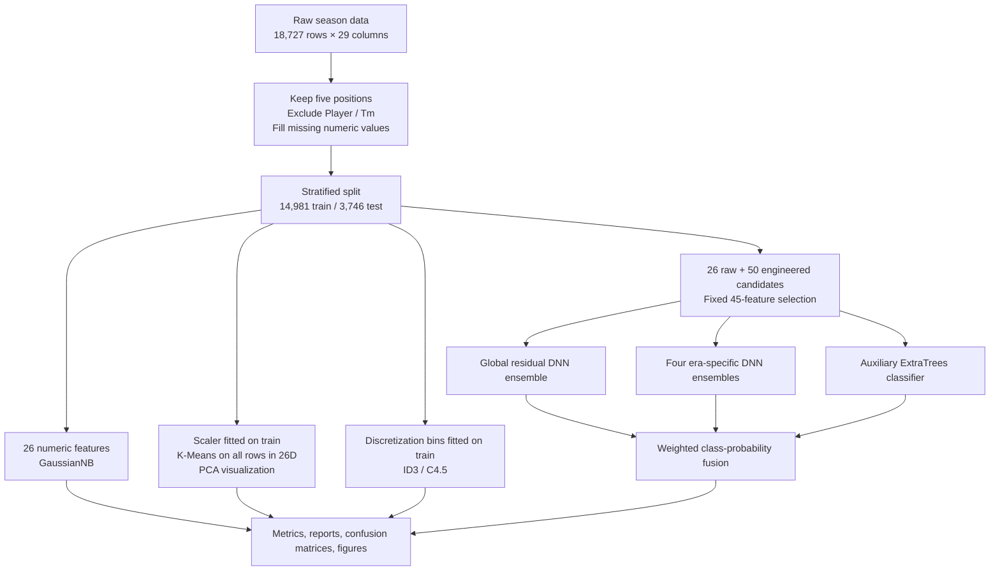
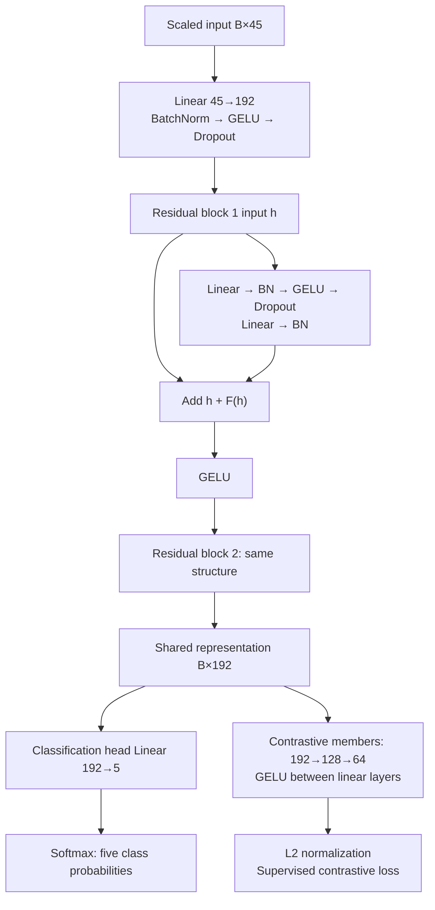
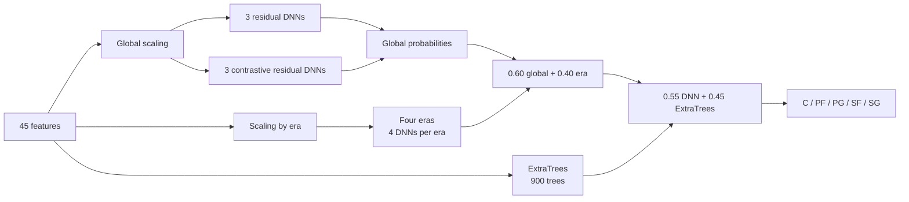

# NBA Player Position Prediction: From Baselines to a Fused DNN

[中文](README.md) · **English** · [Original full report (Chinese)](大数据技术实验_综合实验报告.md)

Predict one of five labeled court positions—center (C), power forward (PF), point guard (PG), small forward (SF), or shooting guard (SG)—from a player's season statistics. The project covers a shared preprocessing pipeline, four baseline experiments (Gaussian Naive Bayes, K-Means, custom ID3, and custom C4.5), and a larger solution with engineered features, residual DNN ensembles, supervised contrastive learning, era specialists, ExtraTrees probability fusion, feature-subset comparisons, and nine ablations.

In practical terms, the models use scoring, rebounding, passing, shot blocking, and shooting patterns to estimate which position best matches a player-season record. The final pipeline combines five-class probabilities from neural networks and a tree ensemble. The original project recorded **72.61% test accuracy and 0.7258 Macro F1**.

## Contents

- [Task and technical pipeline](#task-and-technical-pipeline)
- [Data and preprocessing](#data-and-preprocessing)
- [The five experiments](#the-five-experiments)
- [Deep-learning design](#deep-learning-design)
  - [Layer-by-layer architecture](#2-layer-by-layer-dnn-architecture)
  - [Loss functions](#3-loss-functions-and-supervised-contrastive-learning)
  - [Validation and final training](#4-validation-and-final-training-two-stages)
  - [Inference for one record](#5-from-one-record-to-the-final-position)
- [Results and interpretation](#results-and-interpretation)
- [Feature subsets and ablations](#feature-subsets-and-ablations)
- [Setup, execution, and outputs](#setup-execution-and-outputs)
- [Code guide](#code-guide)

## Task and technical pipeline

Each input row describes one player in one season. The supervised target is `Pos ∈ {C, PF, PG, SF, SG}`. The models use numeric statistics and derived indicators; neither `Player` nor `Tm` is a model feature. Experiments 1–4 establish reference methods, while experiment 5 combines feature engineering and multiple models.



## Data and preprocessing

The repository includes `NBA_Season_Stats.csv` at its root. It contains **18,727 player-season rows, 29 columns, and seasons labeled 1980–2017**. Class counts are C 3,765, PF 3,945, PG 3,753, SF 3,572, and SG 3,692. After cloning the repository, you can run preprocessing and the experiments directly.

Expected columns: `Year, Player, Pos, Age, Tm, G, MP, FG, FGA, FG%, 3P, 3PA, 3P%, 2P, 2PA, 2P%, eFG%, FT, FTA, FT%, ORB, DRB, TRB, AST, STL, BLK, TOV, PF, PTS`.

| Stage | Implementation | Output |
| --- | --- | --- |
| Clean | Keep the five target positions; exclude `Player` and `Tm` from features; coerce 26 feature columns to numeric and replace missing values with zero | `nba_clean*.csv` |
| Split | Stratify by `Pos`, 80/20, `random_state=42` | 14,981 training / 3,746 test rows |
| Scale | Fit `StandardScaler` on the training portion only; transform training, test, and full data | `nba_scaled*.csv` |
| Discretize | Derive up to three quantile bins (`low/mid/high`) from training rows; collapse duplicate boundaries | `nba_discrete*.csv` |
| Record metadata | Save the 26 feature names, label mapping, shapes, and imputation counts | `feature_columns.txt`, `label_mapping.json`, `preprocess_report.json` |

Most missing values occur in percentage columns: `FG%` 88, `3P%` 3,485, `2P%` 117, `eFG%` 88, and `FT%` 742 rows. Supervised methods use the same train/test split. K-Means explores all rows after scaling with training-fitted parameters; true positions are used only after clustering to describe and evaluate the clusters.

### Reading the fields

`G` is games played during the season and `MP` is total minutes played. Counting fields such as points, rebounds, and assists are also season totals, from which per-game and per-36-minute features are derived. Percentage fields use the 0–1 scale: `FG%=0.50` means 50%.

| Fields | Meaning |
| --- | --- |
| `Year` / `Age` / `Player` / `Tm` / `Pos` | Year, age, player, team, position label |
| `FG` / `FGA` / `FG%` | Field goals made, attempted, and shooting percentage |
| `3P` / `3PA` / `3P%`, `2P` / `2PA` / `2P%` | Three-point and two-point makes, attempts, and percentages |
| `eFG%`, `FT` / `FTA` / `FT%` | Effective field-goal percentage; free throws made, attempted, and percentage |
| `ORB` / `DRB` / `TRB` | Offensive, defensive, and total rebounds |
| `AST` / `STL` / `BLK` | Assists, steals, blocks |
| `TOV` / `PF` / `PTS` | Turnovers, personal fouls, points |

The feature column `PF` means personal fouls; the value `PF` in target column `Pos` means power forward. Preprocessing adds `Pos_Label` as a target encoding and excludes it from model inputs. Probability columns follow **`[C, PF, PG, SF, SG]`**, with encoded labels **`[0, 1, 2, 3, 4]`**.

## The five experiments

| Experiment | Inputs and method | Work completed and saved artifacts |
| --- | --- | --- |
| 1. Gaussian Naive Bayes | 26 cleaned continuous features; `sklearn.naive_bayes.GaussianNB` | Test predictions, per-class precision/recall/F1, classification report, confusion matrix, class-metric and prediction-distribution plots |
| 2. K-Means | 26 scaled features; main run uses `k=5`, `n_init=10`, seed 42 | Elbow and silhouette curves for `k=2…10`; ARI, NMI, homogeneity, post-hoc majority mapping; PCA projections and cluster/position heatmaps |
| 3. ID3 | 26 discretized features; custom recursive splitter maximizing **information gain** | Serialized tree, readable IF/THEN rules, feature-usage counts, tree size, predictions and classification figures |
| 4. C4.5 | Same discretized features; custom recursive splitter maximizing **gain ratio** | Tree, rules, feature usage and plots; intentionally basic, without pruning, tuning, or ensembling |
| 5. DNN fusion | 45 selected features; neural and ExtraTrees models | Validation comparison, training history, saved weights, class probabilities, per-class results, feature search, and nine ablations |

### How the baseline algorithms work

| Algorithm | Decision process | Implementation details |
| --- | --- | --- |
| GaussianNB | Estimate a Gaussian distribution for each feature within each class, combine likelihoods with class priors, and choose the largest posterior | Uses cleaned continuous fields; conditional independence allows the likelihood to factor across fields |
| K-Means | Alternate nearest-center assignment and center updates to minimize within-cluster squared distances | Fits all rows in the 26-dimensional scaled space; `max_iter=300`; silhouette uses at most 5,000 sampled rows; PCA is used for visualization |
| ID3 | Recursively select the feature with the greatest information gain and branch by its values | `Gain(D,A) = H(D) − Σᵥ (nᵥ/n) H(Dᵥ)`, with `H(D) = −Σ_c p_c log₂ p_c` |
| C4.5 | Normalize information gain by split information and select the greatest gain ratio | `GainRatio(D,A) = Gain(D,A)/SplitInfo(D,A)`; `SplitInfo = −Σᵥ (nᵥ/n) log₂(nᵥ/n)`; a zero denominator returns zero |

Here `n` is the number of records at the current node, `nᵥ` is the branch size for feature value `v`, and `p_c` is the proportion of position class `c`. Entropy `H` measures label uncertainty.

Both custom trees stop when labels are identical, no features remain, or the best split score is nonpositive. Children recurse with the remaining features. An unseen branch value at prediction time returns the training majority class stored at the current node. This project's C4.5 is a basic discrete-attribute implementation of gain-ratio splitting, without node-level continuous threshold search or pruning.


## Deep-learning design

### 1. From 76 candidate features to the fixed 45-feature input

The code creates 50 derived features in addition to 26 original numeric columns. The current training script uses a **fixed** `SELECTED_FEATURES` list with 17 original and 28 derived fields. The original project also retained historical results for nine compact subsets; their search procedure is not included as a standalone executable script. These are **all 45 final input features**:

| Group | Features | Purpose |
| --- | --- | --- |
| Original statistics (17) | `Year`, `Age`, `G`, `MP`, `FG%`, `3P%`, `2P%`, `eFG%`, `FT%`, `ORB`, `DRB`, `TRB`, `AST`, `STL`, `BLK`, `TOV`, `PF` | Season context, playing time, shooting efficiency, rebounds, playmaking, defense |
| Per-game (8) | `PPG`, `MPG`, `RPG`, `APG`, `SPG`, `BPG`, `TPG`, `FPG` | Reduce dependence on the number of games played |
| Ratios and efficiency (5) | `ThreePAr`, `FTr`, `AST_TOV`, `ORB_Ratio`, `DRB_Ratio` | Shot selection, passing efficiency, rebound composition |
| Per 36 minutes (10) | `PTS_36`, `TRB_36`, `AST_36`, `STL_36`, `BLK_36`, `PF_36`, `3PA_36`, `FTA_36`, `ORB_36`, `DRB_36` | Compare production on a common playing-time scale |
| Position profiles (5) | `Heightless_Big_Profile`, `Primary_Guard_Profile`, `Center_PF_Separation`, `SG_PG_Separation`, `SF_PF_Separation` | Express differences between neighboring positions |

Examples: `PPG = PTS/G`, `ThreePAr = 3PA/FGA`, and `PTS_36 = 36×PTS/MP`. `Center_PF_Separation = BLK_36 + ORB_36 + FTr − 3PA_36` combines rim protection, offensive rebounding, free-throw tendency, and outside shooting. The implementation maps division by zero and non-finite results to zero. `Year` also selects era specialists; names and teams are not used.

<details>
<summary>Expand: formulas for all 28 selected engineered features</summary>

| Features | Formula |
| --- | --- |
| `PPG, MPG, RPG, APG, SPG, BPG, TPG, FPG` | Respectively `PTS, MP, TRB, AST, STL, BLK, TOV, PF` divided by `G` |
| `ThreePAr` / `FTr` / `AST_TOV` | `3PA/FGA` / `FTA/FGA` / `AST/TOV` |
| `ORB_Ratio` / `DRB_Ratio` | `ORB/TRB` / `DRB/TRB` |
| `PTS_36, TRB_36, AST_36, STL_36, BLK_36, PF_36, 3PA_36, FTA_36, ORB_36, DRB_36` | `36×X/MP` for the corresponding counting field `X` |
| `Heightless_Big_Profile` | `TRB_36 + 1.5×BLK_36 + ORB_36 − 0.8×AST_36 − 0.5×3PA_36` |
| `Primary_Guard_Profile` | `AST_36 + 1.2×STL_36 + ThreePAr − 0.8×BLK_36 − 0.5×ORB_36` |
| `Center_PF_Separation` | `BLK_36 + ORB_36 + FTr − 3PA_36` |
| `SG_PG_Separation` | `3PA_36 + PTS_36 − AST_36` |
| `SF_PF_Separation` | `3PA_36 + STL_36 − ORB_36 − BLK_36` |

These profiles are manually designed combinations of statistics and are standardized alongside the other selected fields. `Heightless_Big_Profile` uses statistics alone; the dataset contains no height field. Definitions of all 50 engineered candidates are in [`add_engineered_features()`](experiments/experiment5_dnn.py#L224).

</details>


### 2. Layer-by-layer DNN architecture

The final backbone is a residual fully connected network for tabular inputs. For a batch of `B` records, input shape is `B×45` and hidden representation shape is `B×192`.

| Component | Layers in execution order | Output shape |
| --- | --- | --- |
| Input transformation | `Linear(45,192) → BatchNorm1d(192) → GELU → Dropout(0.15)` | `B×192` |
| Residual block 1 | Structure below, with width 192 throughout | `B×192` |
| Residual block 2 | Same structure | `B×192` |
| Classification head | `Linear(192,5)` | `B×5` unnormalized logits |
| Probability conversion during inference | `Softmax(dim=1)` across the five logits of each record | `B×5`, summing to one per record |
| Additional projection head in contrastive members | Branch from the second block: `Linear(192,128) → GELU → Linear(128,64)` | `B×64` for training-time contrastive loss |

Each residual block computes `GELU(h + F(h))`, with this sequence inside `F(h)`:

```text
Linear(192,192) → BatchNorm1d(192) → GELU → Dropout(0.15)
→ Linear(192,192) → BatchNorm1d(192)
```

The skip connection carries `h` directly to the addition, allowing the block to learn a correction to its existing representation. BatchNorm normalizes hidden activations, GELU provides nonlinearity, and Dropout randomly masks activations during training. `ResidualPositionNet` and `ContrastiveResidualPositionNet` share this backbone.



The classification head returns logits in `forward()` for cross-entropy training. Probabilities are calculated during inference. The projection head constrains the representation during contrastive training, while classification-head probabilities participate in final fusion.

### 3. Loss functions and supervised contrastive learning

Regular residual members use cross-entropy `L_CE` with `label_smoothing=0.02`. Contrastive members use:

```text
L_total = L_CE + 0.10 × L_SupCon
```

Within a training batch, the 64-dimensional projections are L2-normalized. Pairwise inner products are divided by temperature `τ=0.20`. For anchor `i`, other records with the same position form the positive set `P(i)`; the denominator includes every other record in the batch:

$$
L_{\mathrm{SupCon}} = -\frac{1}{B}\sum_{i=1}^{B}\frac{1}{|P(i)|}
\sum_{p\in P(i)}\log\frac{\exp(z_i^\top z_p/\tau)}
{\sum_{a\ne i}\exp(z_i^\top z_a/\tau)}.
$$

Small constants stabilize division and logarithms; anchors with no positive contribute zero. Cross-entropy trains correct position predictions, while contrastive loss encourages representations of the same position to be closer. Sample pairs are formed directly from labeled records within each batch.

### 4. Validation and final training: two stages

First, ordinary `PositionNet` configurations are compared within the training partition. Then the residual ensemble configurations fixed in the script are trained. Each hidden layer of `PositionNet` follows `Linear → BatchNorm → GELU → Dropout`, followed by a five-class linear output layer.

| Ordinary DNN validation configuration | Hidden layers | Dropout | Learning rate | Best epoch | Validation Macro F1 |
| --- | --- | ---: | ---: | ---: | ---: |
| 1 | `[256,128,64]` | 0.20 | 0.0010 | 70 | **0.6899** |
| 2 | `[384,192,96]` | 0.20 | 0.0008 | 52 | 0.6881 |
| 3 | `[512,256,128]` | 0.25 | 0.0007 | 36 | 0.6826 |

The winning ordinary configuration supplies the saved validation record and curve. Final training uses the widths, epochs, and seeds defined in `FINAL_ENSEMBLE_MEMBERS` and `ERA_EXPERT_MEMBERS`.

Ordinary DNN configuration validation uses a position-stratified split with `random_state=42`. Each configuration runs for at most 140 epochs, saves parameters at the best validation Macro F1, and stops after 22 epochs without improvement. The final residual ensemble uses the full training partition and fixed epoch counts, with the following member configurations.

During validation, scaling is fitted on the 11,984-row training subset and applied to 2,997 validation rows. Final training fits a new global scaler and global models on **all 14,981 training records**. Each era fits its own scaler on its training records. ExtraTrees uses the 45 engineered inputs without standardization.

| Final DNN group | Members | Seeds | Epochs per member | Within-group probability weight |
| --- | ---: | --- | ---: | --- |
| Global regular residual | 3 | 42, 7, 2026 | 100 | 1/6 of global probabilities per member |
| Global contrastive residual | 3 | 42, 7, 2026 | 110 | 1/6 of global probabilities per member |
| Regular residual within each era | 2 | 42, 7 | 120 | 1/4 of that era's probabilities per member |
| Contrastive residual within each era | 2 | 42, 7 | 120 | 1/4 of that era's probabilities per member |

Final training includes **6 + 4×4 = 22 DNN members**, plus one ExtraTrees classifier containing 900 trees. Residual members use learning rate `8×10⁻⁴`, weight decay `10⁻⁴`, batch size 512, AdamW, and CosineAnnealingLR, and run for fixed epoch counts.

ExtraTrees uses `max_features=0.70`, `min_samples_leaf=3`, `criterion="gini"`, `class_weight="balanced"`, `random_state=42`, and `n_jobs=-1`. Its randomized tree splits provide another way of modeling feature combinations, with probabilities combined with the neural predictions.

| Era | Training rows | Test rows |
| --- | ---: | ---: |
| `<1990` | 3,033 | 758 |
| `1990–1999` | 3,911 | 976 |
| `2000–2009` | 4,303 | 1,045 |
| `≥2010` | 3,734 | 967 |

### 5. From one record to the final position

1. Compute engineered features from cleaned season totals and select 45 fields in `SELECTED_FEATURES` order.
2. Apply global scaling and average five-class probabilities from six global DNNs to obtain `p_global`.
3. Route by `Year`, then use that era's scaler and four specialists to calculate `p_era`. Routing follows the year rule; if the bucket has no training records, the code falls back to global probabilities.
4. Calculate `p_tree` from ExtraTrees using the same 45 inputs without scaling. All distributions follow `[C, PF, PG, SF, SG]`.
5. Apply the following equations, select the highest-scoring class, and decode the position name:

```text
p_dnn   = 0.60 × p_global + 0.40 × p_era
p_final = 0.55 × p_dnn    + 0.45 × p_tree
        = 0.33 × p_global + 0.22 × p_era + 0.45 × p_tree
predicted_position = labels[argmax(p_final)]
```

Each record uses six global networks and four specialists from its era, for a total of ten DNN members, alongside ExtraTrees. Fusion retains each member's full distribution over the five classes.



The following curve shows validation accuracy and Macro F1 for the best ordinary `PositionNet` configuration and corresponds to `training_history.csv`.


## Results and interpretation

| Method | Features | Accuracy | Macro F1 | Weighted F1 | Verification |
| --- | ---: | ---: | ---: | ---: | --- |
| Gaussian Naive Bayes | 26 | 0.4477 | 0.4027 | 0.4019 | Verified by rerun |
| K-Means | 26 | — | — | — | See clustering metrics below |
| ID3 | 26 | 0.4357 | 0.4360 | 0.4362 | Verified by rerun |
| C4.5 | 26 | 0.4327 | 0.4328 | 0.4332 | Verified by rerun |
| DNN + probability fusion | 45 | **0.7261** | **0.7258** | **0.7259** | Original project result |

Accuracy is the fraction of correctly predicted test records. Macro F1 calculates each position's F1 and averages the five scores equally. Weighted F1 weights them by class support. Together, they describe overall correctness and performance across positions.

The original project also saved component results on the same test split:

| Component or fusion stage | Accuracy | Macro F1 |
| --- | ---: | ---: |
| Average probabilities from six global DNNs | 0.6997 | 0.7001 |
| Era specialists routed by year | 0.7125 | 0.7122 |
| Global + era DNN probabilities | 0.7168 | 0.7167 |
| ExtraTrees alone | 0.6909 | 0.6899 |
| Final DNN + ExtraTrees fusion | **0.7261** | **0.7258** |

At `k=5`, K-Means has silhouette **0.2070**, adjusted Rand index **0.0166**, normalized mutual information **0.0509**, homogeneity **0.0476**, and post-hoc majority-mapping accuracy **0.2519**. The silhouette for `k=2` is higher (0.3524), but the main run fixes five clusters to correspond to the five labeled positions. Natural clusters in statistic space do not automatically match those labels.


The custom ID3 tree has **11,846 nodes, 6,727 leaves, and maximum depth 19**; C4.5 has **11,802 nodes, 6,638 leaves, and maximum depth 26**. Neither tree is pruned. Naive Bayes has relatively high recall for C and PG but weak recall for PF, SF, and SG; the two tree methods reach Macro F1 near 0.43.


Per-class metrics for the final fused model:

| Position | Precision | Recall | F1 |
| --- | ---: | ---: | ---: |
| C | 0.7653 | 0.7450 | 0.7550 |
| PF | 0.6574 | 0.6591 | 0.6582 |
| PG | 0.8505 | 0.8708 | **0.8605** |
| SF | 0.6583 | 0.6583 | 0.6583 |
| SG | 0.6969 | 0.6969 | 0.6969 |

PG is the clearest class. PF, SF, and SG remain harder to separate. In the confusion matrix, 162 actual C rows are predicted PF and 148 actual PF rows are predicted C; 118 actual SF rows are predicted SG and 118 actual SG rows are predicted SF. PG and SG are also confused in both directions.


### Other work in the original project

- **Feature selection:** Saved comparisons cover the 26 raw + 50 derived candidates, importance-based Top-k sets, domain-compact sets, and position-separation sets. The current code fixes the 45-feature input; it does not regenerate the historical search.
- **Network configuration search:** Three ordinary DNN layer configurations were compared, with validation scores, best epochs, and learning curves saved.
- **Fusion-weight probes:** Historical tables explore combinations of global DNN, era specialists, and ExtraTrees; the production script uses the fixed weights described above.
- **Hierarchical probes:** Archived tables explore coarse-to-fine position prediction and multitask hierarchical variants. They are not part of the current final inference pipeline.
- **Reports and presentations:** The original project generated per-experiment reports, prediction tables, tree rules, model weights, a full course report, and five presentation variants. The repository includes the raw CSV, code, full report, and its 28 referenced figures. Model weights, detailed predictions, and PPTX files can be generated locally.

## Feature subsets and ablations

The following are the original project's **nine saved full-pipeline feature-subset comparisons**, showing input size and recorded results.

| Feature set | Size | Accuracy | Macro F1 |
| --- | ---: | ---: | ---: |
| `separation_core_45` | 45 | **0.7261** | **0.7258** |
| `separation_plus_all_profiles_54` | 54 | 0.7226 | 0.7227 |
| `separation_plus_usage_52` | 52 | 0.7205 | 0.7202 |
| `separation_plus_indices_50` | 50 | 0.7192 | 0.7190 |
| `domain_compact_42` | 42 | 0.7173 | 0.7170 |
| `importance_top_35` | 35 | 0.7157 | 0.7158 |
| `domain_compact_36` | 36 | 0.7114 | 0.7114 |
| `importance_top_30` | 30 | 0.7117 | 0.7113 |
| `profile_core_32` | 32 | 0.7058 | 0.7057 |

The nine ablations compare each variant against complete configuration A0. The drop is `A0 Macro F1 − variant Macro F1`. A0, A6, and A8 can be copied or derived from experiment 5 outputs; the other variants were trained separately.

A3 retains the contrastive members' architecture while disabling contrastive loss. A4 removes contrastive members and renormalizes weights among the remaining regular members. A7 uses a single regular residual network and also disables era specialists and tree fusion, measuring the difference between the complete pipeline and a single-network configuration.

| Variant | Change | Macro F1 | Drop from A0 |
| --- | --- | ---: | ---: |
| A0 | Complete pipeline | **0.7258** | — |
| A1 | Use all 76 candidates | 0.7212 | 0.0046 |
| A2 | Use only 26 raw features | 0.7032 | 0.0226 |
| A3 | Remove contrastive loss | 0.7225 | 0.0033 |
| A4 | Remove contrastive DNN members | 0.7209 | 0.0049 |
| A5 | Remove era specialists | 0.7107 | 0.0151 |
| A6 | Remove ExtraTrees fusion | 0.7167 | 0.0091 |
| A7 | Use one regular residual DNN | 0.6972 | 0.0286 |
| A8 | Use ExtraTrees only | 0.6899 | 0.0359 |

The ablations show larger contributions from engineered features, DNN ensembling, and era specialists in this configuration.


## Setup, execution, and outputs

Python 3.11 is recommended. `requirements.txt` covers NumPy, pandas, scikit-learn, Matplotlib, PyTorch, and tabulate. Optional presentation scripts also need python-pptx and Pillow from `requirements-ppt.txt`. The DNN can select CUDA or CPU; the original run recorded CUDA on an NVIDIA GeForce RTX 4060 Laptop GPU. Runtime and numerical results may vary across environments.

```bash
git clone https://github.com/LRZer/nba-player-position-prediction.git
cd nba-player-position-prediction
python -m pip install -r requirements.txt
```

With Conda, activate an existing Python 3.11 / PyTorch environment before installing dependencies, or create a separate environment:

```bash
conda create -n nba-position python=3.11 -y
conda activate nba-position
python -m pip install -r requirements.txt
```

The CSV is already at the repository root. Run the following commands in order:

```bash
python scripts/preprocess_nba.py
python experiments/experiment1_bayes.py
python experiments/experiment2_kmeans.py
python experiments/experiment3_id3.py
python experiments/experiment4_c45.py
python experiments/experiment5_dnn.py
python experiments/experiment5_ablation.py
```

After preprocessing, each baseline can run independently. Experiment 5 reads `nba_clean_train.csv` and `nba_clean_test.csv`, then engineers and scales its own inputs. `experiment5_dnn.py` runs ordinary-network validation followed by final ensemble training; every execution retrains the models and takes substantially longer than the baselines.

`experiment5_ablation.py` requires experiment 5's `metrics.json` and `predictions.csv`. It reuses existing variant metrics by default and trains variants whose caches are missing. `--force` retrains A1–A5 and A7, and recalculates A0, A6, and A8 from experiment 5 outputs.

| Path | Generated material | In the public repository |
| --- | --- | --- |
| `processed/` | Nine clean/scaled/discretized full/train/test CSV files; feature names, label mapping, preprocessing report | Generated locally |
| `results/experiment1_bayes/` | Metrics, classification report, predictions, confusion matrix, class metrics, distribution | Report figures only |
| `results/experiment2_kmeans/` | k search, assignments, cluster summaries/crosstabs, PCA projections and plots | Report figures only |
| `results/experiment3_id3/`, `experiment4_c45/` | Metrics, tree JSON, text rules, feature usage, predictions and plots | Report figures only |
| `results/experiment5_dnn/` | Validation, training, class predictions, selected features, weights, plots, auxiliary probe tables | Report figures only |
| `results/experiment5_feature_selection_search/` | Nine historical subset comparisons, predictions, plots and separate report | Report figures only; search script unavailable |
| `results/experiment5_ablation/` | A0–A8 metrics, predictions, summary tables, report and plots | Report figures only |
| `scripts/generate_*_ppt.py` | Five optional presentation-generation scripts that read saved results | Scripts included; PPTX files excluded |

### Model file and prediction records

`results/experiment5_dnn/metrics.json` records configuration, data sizes, component scores, and final scores. `predictions.csv` records the true position, global/era/DNN/tree predicted classes, final class, and correctness. This CSV contains class decisions; full component probability arrays are used in memory during fusion.

`dnn_model.pt` stores parameters for 22 DNN members, member configurations, label order, the 45-feature order, and the global scaler's means and scales. It also stores the ExtraTrees configuration. The fitted tree object and era-specific scaler parameters remain in the run's memory and are not included in this file. The complete fused prediction is performed by `experiment5_dnn.py` after training.

To generate presentations, install `requirements-ppt.txt`, run the relevant experiments to produce JSON, CSV, and figures, then run the desired `scripts/generate_*_ppt.py`. The combined-presentation script falls back to a blank deck if its optional template is missing.

`generate_deep_learning_ppt.py` additionally reads the historical `results/model_comparison_summary.csv`; `generate_academic_deep_learning_ppt.py` reads the historical `results/experiment5_feature_selection_search/compact_feature_search_results.csv`. These tables are retained in the original local project and are not regenerated by the current experiment scripts. Historical feature figures and the result tables in this README are directly available in the repository.

| Optional script | Generated presentation |
| --- | --- |
| `generate_deep_learning_ppt.py` | `NBA_position_deep_learning_report.pptx` |
| `generate_academic_deep_learning_ppt.py` | `NBA_position_deep_learning_academic_report.pptx` |
| `generate_deep_learning_design_ppt.py` | `NBA_position_deep_learning_design_report.pptx` |
| `generate_deep_learning_teaching_ppt.py` | `NBA_position_deep_learning_teaching_report.pptx` |
| `generate_bigdata_experiment_ppt.py` | `大数据技术实验_深度学习模型汇报.pptx` |

## Code guide

| Topic | Code entry point |
| --- | --- |
| Cleaning, splitting, scaling, and discretization | `main()` and `fit_discretizer()` in [`scripts/preprocess_nba.py`](scripts/preprocess_nba.py) |
| Gaussian Naive Bayes and K-Means analysis | [`experiment1_bayes.py`](experiments/experiment1_bayes.py), [`experiment2_kmeans.py`](experiments/experiment2_kmeans.py) |
| Custom tree construction, prediction, and rule export | [`experiment3_id3.py`](experiments/experiment3_id3.py), [`experiment4_c45.py`](experiments/experiment4_c45.py) |
| All 50 engineered candidates and the fixed 45-feature selection | `add_engineered_features()`, `ENGINEERED_FEATURES`, and `SELECTED_FEATURES` in [`experiment5_dnn.py`](experiments/experiment5_dnn.py) |
| Ordinary MLP, residual blocks, classification and projection heads | `PositionNet`, `ResidualBlock`, `ResidualPositionNet`, `ContrastiveResidualPositionNet` in the same file |
| Contrastive loss, validation training, and final member training | `supervised_contrastive_loss()`, `train_one_config()`, `train_full_member()` in the same file |
| Era routing, training 22 networks, and probability fusion | `era_bucket()` and `main()` in the same file |
| Ablation switches, cache reuse, and derived results | `ABLATION_CONFIGS`, `members_for_config()`, `derive_from_current()` in [`experiment5_ablation.py`](experiments/experiment5_ablation.py) |
