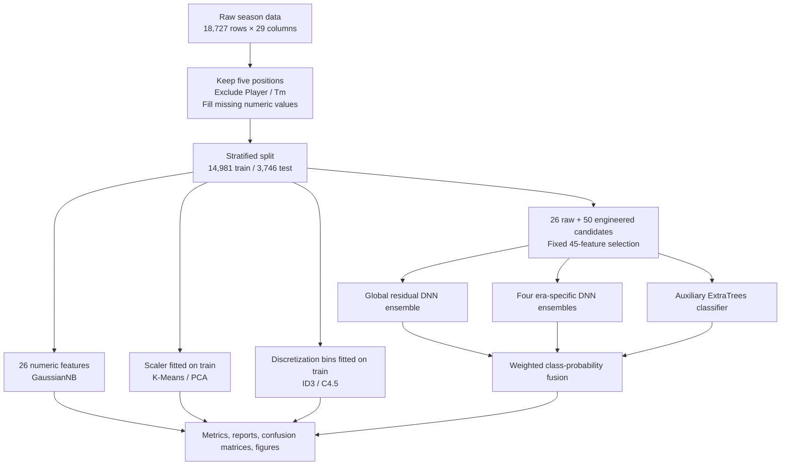
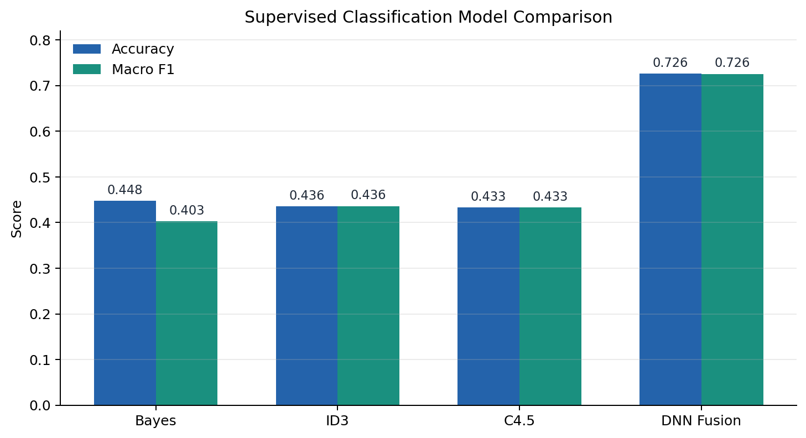
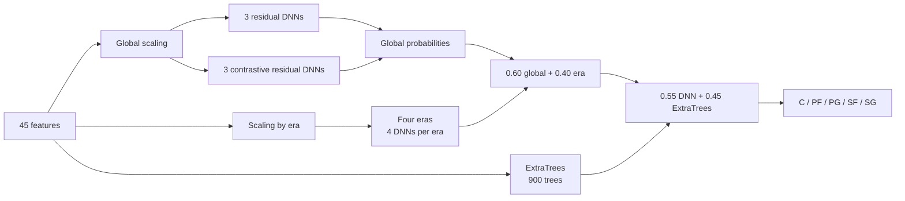

# NBA Player Position Prediction: From Baselines to a Fused DNN

[中文](README.md) · **English** · [Original full report (Chinese)](大数据技术实验_综合实验报告.md)

Predict one of five labeled court positions—center (C), power forward (PF), point guard (PG), small forward (SF), or shooting guard (SG)—from a player's season statistics. The project covers a shared preprocessing pipeline, four baseline experiments (Gaussian Naive Bayes, K-Means, custom ID3, and custom C4.5), and a larger solution with engineered features, residual DNN ensembles, supervised contrastive learning, era specialists, ExtraTrees probability fusion, feature-subset comparisons, and nine ablations.

> **How to read the results:** Preprocessing and experiments 1–4 were rerun locally while organizing this repository, and their metrics matched the saved records. The DNN and feature-search figures are from the original project. This organization pass verified 45-feature construction and a DNN forward pass, but did not retrain the full ensemble. The ablation script ran using its existing local cache; this was not a fresh training run of every variant.

## Contents

- [Task and technical pipeline](#task-and-technical-pipeline)
- [Data and preprocessing](#data-and-preprocessing)
- [The five experiments](#the-five-experiments)
- [Deep-learning design](#deep-learning-design)
- [Results and interpretation](#results-and-interpretation)
- [Feature subsets and ablations](#feature-subsets-and-ablations)
- [Setup, execution, and outputs](#setup-execution-and-outputs)
- [Reproducibility and limitations](#reproducibility-and-limitations)

## Task and technical pipeline

Each input row describes one player in one season. The supervised target is `Pos ∈ {C, PF, PG, SF, SG}`. The models use numeric statistics and derived indicators; neither `Player` nor `Tm` is a model feature. Experiments 1–4 are basic reference methods. Experiment 5 combines substantially more feature engineering and modeling work, so the performance difference cannot be attributed to neural network architecture alone.



## Data and preprocessing

The local `NBA_Season_Stats.csv` contains **18,727 player-season rows, 29 columns, and seasons labeled 1980–2017**. Class counts are C 3,765, PF 3,945, PG 3,753, SF 3,572, and SG 3,692. The precise origin and redistribution terms of the existing CSV have not been verified, so the public repository provides code and documentation only. To run the project, place an equivalent CSV at the repository root under the name `NBA_Season_Stats.csv`.

Expected columns: `Year, Player, Pos, Age, Tm, G, MP, FG, FGA, FG%, 3P, 3PA, 3P%, 2P, 2PA, 2P%, eFG%, FT, FTA, FT%, ORB, DRB, TRB, AST, STL, BLK, TOV, PF, PTS`.

| Stage | Implementation | Output |
| --- | --- | --- |
| Clean | Keep the five target positions; exclude `Player` and `Tm` from features; coerce 26 feature columns to numeric and replace missing values with zero | `nba_clean*.csv` |
| Split | Stratify by `Pos`, 80/20, `random_state=42` | 14,981 training / 3,746 test rows |
| Scale | Fit `StandardScaler` on the training portion only; transform training, test, and full data | `nba_scaled*.csv` |
| Discretize | Derive up to three quantile bins (`low/mid/high`) from training rows; collapse duplicate boundaries | `nba_discrete*.csv` |
| Record metadata | Save the 26 feature names, label mapping, shapes, and imputation counts | `feature_columns.txt`, `label_mapping.json`, `preprocess_report.json` |

Most missing values occur in percentage columns: `FG%` 88, `3P%` 3,485, `2P%` 117, `eFG%` 88, and `FT%` 742 rows. Supervised methods use the same train/test split. K-Means explores all rows after scaling with training-fitted parameters; true positions are used only after clustering to describe and evaluate the clusters.

## The five experiments

| Experiment | Inputs and method | Work completed and saved artifacts |
| --- | --- | --- |
| 1. Gaussian Naive Bayes | 26 cleaned continuous features; `sklearn.naive_bayes.GaussianNB` | Test predictions, per-class precision/recall/F1, classification report, confusion matrix, class-metric and prediction-distribution plots |
| 2. K-Means | 26 scaled features; main run uses `k=5`, `n_init=10`, seed 42 | Elbow and silhouette curves for `k=2…10`; ARI, NMI, homogeneity, post-hoc majority mapping; PCA projections and cluster/position heatmaps |
| 3. ID3 | 26 discretized features; custom recursive splitter maximizing **information gain** | Serialized tree, readable IF/THEN rules, feature-usage counts, tree size, predictions and classification figures |
| 4. C4.5 | Same discretized features; custom recursive splitter maximizing **gain ratio** | Tree, rules, feature usage and plots; intentionally basic, without pruning, tuning, or ensembling |
| 5. DNN fusion | 45 selected features; neural and ExtraTrees models | Validation comparison, training history, saved weights, class probabilities, per-class results, feature search, and nine ablations |

For an unseen branch value at prediction time, the ID3 and C4.5 implementations return the training majority class stored at the current tree node. Their readable rules make the decisions inspectable, while discretization removes some numeric detail.



## Deep-learning design

### 1. From 76 candidate features to the fixed 45-feature input

The code creates 50 derived features in addition to 26 original numeric columns. The current training script uses a **fixed** `SELECTED_FEATURES` list with 17 original and 28 derived fields. The original project also retained historical results for nine compact subsets; their search procedure is not included as a standalone executable script. These are **all 45 final input features**:

| Group | Features | Purpose |
| --- | --- | --- |
| Original statistics (17) | `Year`, `Age`, `G`, `MP`, `FG%`, `3P%`, `2P%`, `eFG%`, `FT%`, `ORB`, `DRB`, `TRB`, `AST`, `STL`, `BLK`, `TOV`, `PF` | Season context, playing time, shooting efficiency, rebounds, playmaking, defense |
| Per-game (8) | `PPG`, `MPG`, `RPG`, `APG`, `SPG`, `BPG`, `TPG`, `FPG` | Reduce dependence on the number of games played |
| Ratios and efficiency (5) | `ThreePAr`, `FTr`, `AST_TOV`, `ORB_Ratio`, `DRB_Ratio` | Shot selection, passing efficiency, rebound composition |
| Per 36 minutes (10) | `PTS_36`, `TRB_36`, `AST_36`, `STL_36`, `BLK_36`, `PF_36`, `3PA_36`, `FTA_36`, `ORB_36`, `DRB_36` | Compare production on a common playing-time scale |
| Position profiles (5) | `Heightless_Big_Profile`, `Primary_Guard_Profile`, `Center_PF_Separation`, `SG_PG_Separation`, `SF_PF_Separation` | Express differences between neighboring positions |

Examples: `PPG = PTS/G`, `ThreePAr = 3PA/FGA`, and `PTS_36 = 36×PTS/MP`. `Center_PF_Separation = BLK_36 + ORB_36 + FTr − 3PA_36` combines rim protection, offensive rebounding, free-throw tendency, and outside shooting. The implementation maps division by zero and non-finite results to zero. `Year` also selects era specialists; names and teams are not used.


### 2. Validation, training, and probability fusion

1. The 14,981-row training partition is further stratified into 11,984 training and 2,997 validation rows. The scaler is fitted to the relevant training rows. Three ordinary fully connected configurations are compared by validation Macro F1 with early stopping (maximum 140 epochs, patience 22). The best recorded configuration is `[256, 128, 64]`, dropout 0.20, learning rate 0.001, best epoch 70, validation Macro F1 0.6899. This configuration search is distinct from the final residual ensemble.
2. The final global ensemble takes 45 inputs and uses width 192, two residual blocks, and dropout 0.15. Three regular residual members with seeds 42, 7, and 2026 train for 100 epochs; three contrastive residual members with the same seeds train for 110 epochs. Their five-class probabilities are equally weighted.
3. Contrastive members add supervised contrastive loss (weight 0.10, temperature 0.20) to cross-entropy with label smoothing 0.02. Training uses batch size 512, AdamW, and cosine learning-rate scheduling.
4. `Year` defines four eras: `<1990`, `1990–1999`, `2000–2009`, and `≥2010`. Each era trains two regular and two contrastive residual members for 120 epochs per member. The four probabilities are averaged; each specialist predicts only rows in its era.
5. Global and era probabilities are mixed **0.60 : 0.40**. An `ExtraTreesClassifier` with 900 trees, `max_features=0.70`, `min_samples_leaf=3`, and balanced class weights provides an auxiliary distribution. The final score is **0.55 × fused DNN probabilities + 0.45 × ExtraTrees probabilities**; the highest-scoring class is returned.




## Results and interpretation

| Method | Features | Accuracy | Macro F1 | Weighted F1 | Verification |
| --- | ---: | ---: | ---: | ---: | --- |
| Gaussian Naive Bayes | 26 | 0.4477 | 0.4027 | 0.4019 | Rerun during repository organization |
| K-Means | 26 | — | — | — | Unsupervised; classification accuracy is not directly comparable |
| ID3 | 26 | 0.4357 | 0.4360 | 0.4362 | Rerun |
| C4.5 | 26 | 0.4327 | 0.4328 | 0.4332 | Rerun |
| DNN + probability fusion | 45 | **0.7261** | **0.7258** | **0.7259** | Saved original training result; not fully retrained in this pass |

At `k=5`, K-Means has silhouette **0.2070**, adjusted Rand index **0.0166**, normalized mutual information **0.0509**, homogeneity **0.0476**, and post-hoc majority-mapping accuracy **0.2519**. The silhouette for `k=2` is higher (0.3524), but the main run fixes five clusters to correspond to the five labeled positions. Natural clusters in statistic space do not automatically match those labels.


The custom ID3 tree has **11,846 nodes, 6,727 leaves, and maximum depth 19**; C4.5 has **11,802 nodes, 6,638 leaves, and maximum depth 26**. Neither tree is pruned. Naive Bayes has relatively high recall for C and PG but weak recall for PF, SF, and SG; the two tree methods reach Macro F1 near 0.43.


Per-class metrics for the final fused model:

| Position | Precision | Recall | F1 |
| --- | ---: | ---: | ---: |
| C | 0.7653 | 0.7450 | 0.7550 |
| PF | 0.6574 | 0.6591 | 0.6582 |
| PG | 0.8505 | 0.8708 | **0.8605** |
| SF | 0.6583 | 0.6583 | 0.6583 |
| SG | 0.6969 | 0.6969 | 0.6969 |

PG is the clearest class. PF, SF, and SG remain harder to separate. In the confusion matrix, 162 actual C rows are predicted PF and 148 actual PF rows are predicted C; 118 actual SF rows are predicted SG and 118 actual SG rows are predicted SF. PG and SG are also confused in both directions.


### Other work in the original project

- **Feature selection:** Saved comparisons cover the 26 raw + 50 derived candidates, importance-based Top-k sets, domain-compact sets, and position-separation sets. The current code fixes the 45-feature input; it does not regenerate the historical search.
- **Network configuration search:** Three ordinary DNN layer configurations were compared, with validation scores, best epochs, and learning curves saved.
- **Fusion-weight probes:** Historical tables explore combinations of global DNN, era specialists, and ExtraTrees; the production script uses the fixed weights described above.
- **Hierarchical probes:** Archived tables explore coarse-to-fine position prediction and multitask hierarchical variants. They are not part of the current final inference pipeline.
- **Reports and presentations:** The original project generated per-experiment reports, prediction tables, tree rules, model weights, a full course report, and five presentation variants. This public repository includes code, the full report, and its 28 referenced figures. Data, weights, detailed predictions, and PPTX files remain local.

## Feature subsets and ablations

The following are the original project's **nine saved full-pipeline feature-subset comparisons**. They report test-set performance and should not be treated as an independent, untouched final evaluation if these results informed model selection.

| Feature set | Size | Accuracy | Macro F1 |
| --- | ---: | ---: | ---: |
| `separation_core_45` | 45 | **0.7261** | **0.7258** |
| `separation_plus_all_profiles_54` | 54 | 0.7226 | 0.7227 |
| `separation_plus_usage_52` | 52 | 0.7205 | 0.7202 |
| `separation_plus_indices_50` | 50 | 0.7192 | 0.7190 |
| `domain_compact_42` | 42 | 0.7173 | 0.7170 |
| `importance_top_35` | 35 | 0.7157 | 0.7158 |
| `domain_compact_36` | 36 | 0.7114 | 0.7114 |
| `importance_top_30` | 30 | 0.7117 | 0.7113 |
| `profile_core_32` | 32 | 0.7058 | 0.7057 |

The nine ablations compare each variant against complete configuration A0. The drop is `A0 Macro F1 − variant Macro F1`. A0, A6, and A8 can be copied or derived from experiment 5 outputs; the other variants were trained in the original project. This organization pass reused their local caches.

| Variant | Change | Macro F1 | Drop from A0 |
| --- | --- | ---: | ---: |
| A0 | Complete pipeline | **0.7258** | — |
| A1 | Use all 76 candidates | 0.7212 | 0.0046 |
| A2 | Use only 26 raw features | 0.7032 | 0.0226 |
| A3 | Remove contrastive loss | 0.7225 | 0.0033 |
| A4 | Remove contrastive DNN members | 0.7209 | 0.0049 |
| A5 | Remove era specialists | 0.7107 | 0.0151 |
| A6 | Remove ExtraTrees fusion | 0.7167 | 0.0091 |
| A7 | Use one regular residual DNN | 0.6972 | 0.0286 |
| A8 | Use ExtraTrees only | 0.6899 | 0.0359 |

On this dataset and split, engineered features, DNN ensembling, and era specialists correspond to larger differences. Small differences should not be described as statistically established gains.


## Setup, execution, and outputs

Python 3.11 is recommended. `requirements.txt` covers NumPy, pandas, scikit-learn, Matplotlib, PyTorch, and tabulate. Optional presentation scripts also need python-pptx and Pillow from `requirements-ppt.txt`. The DNN can select CUDA or CPU; the original run recorded CUDA on an NVIDIA GeForce RTX 4060 Laptop GPU. Runtime and numerical results may vary across environments.

```bash
git clone https://github.com/LRZer/nba-player-position-prediction.git
cd nba-player-position-prediction
python -m pip install -r requirements.txt
```

Place a compatible `NBA_Season_Stats.csv` at the root, then run:

```bash
python scripts/preprocess_nba.py
python experiments/experiment1_bayes.py
python experiments/experiment2_kmeans.py
python experiments/experiment3_id3.py
python experiments/experiment4_c45.py
python experiments/experiment5_dnn.py
python experiments/experiment5_ablation.py
```

`experiment5_dnn.py` trains many global and era-specific networks and takes substantially longer than the other experiments. `experiment5_ablation.py` reuses variant `metrics.json` files when they already exist. Pass `--force` to retrain applicable ablations, after running experiment 5 and allowing enough compute time.

| Path | Generated material | In the public repository |
| --- | --- | --- |
| `processed/` | Nine clean/scaled/discretized full/train/test CSV files; feature names, label mapping, preprocessing report | Generated locally |
| `results/experiment1_bayes/` | Metrics, classification report, predictions, confusion matrix, class metrics, distribution | Report figures only |
| `results/experiment2_kmeans/` | k search, assignments, cluster summaries/crosstabs, PCA projections and plots | Report figures only |
| `results/experiment3_id3/`, `experiment4_c45/` | Metrics, tree JSON, text rules, feature usage, predictions and plots | Report figures only |
| `results/experiment5_dnn/` | Validation, training, class predictions, selected features, weights, plots, auxiliary probe tables | Report figures only |
| `results/experiment5_feature_selection_search/` | Nine historical subset comparisons, predictions, plots and separate report | Report figures only; search script unavailable |
| `results/experiment5_ablation/` | A0–A8 metrics, predictions, summary tables, report and plots | Report figures only |
| `scripts/generate_*_ppt.py` | Five optional presentation-generation scripts that read saved results | Scripts included; PPTX files excluded |

To generate presentations, install `requirements-ppt.txt` and run the desired `scripts/generate_*_ppt.py` after the required results exist. The combined-presentation script falls back to a blank deck if its optional template is missing. Some presentation scripts require local JSON, CSV, and figures and cannot produce a complete deck immediately after a code-only clone.

| Optional script | Generated presentation |
| --- | --- |
| `generate_deep_learning_ppt.py` | `NBA_position_deep_learning_report.pptx` |
| `generate_academic_deep_learning_ppt.py` | `NBA_position_deep_learning_academic_report.pptx` |
| `generate_deep_learning_design_ppt.py` | `NBA_position_deep_learning_design_report.pptx` |
| `generate_deep_learning_teaching_ppt.py` | `NBA_position_deep_learning_teaching_report.pptx` |
| `generate_bigdata_experiment_ppt.py` | `大数据技术实验_深度学习模型汇报.pptx` |

## Reproducibility and limitations

1. **The dataset is not redistributed.** Its exact source and redistribution terms are unverified. Different data sources, fields, or year ranges will change the results.
2. **Verification scope is explicit.** Preprocessing and experiments 1–4 were rerun; the DNN passed feature-construction and forward-pass checks; ablations used cached outputs. Historical training metrics are not presented as fresh results.
3. **Rows, not players, are split.** Seasons or team stints of the same player may appear in both training and test sets. This split does not establish generalization to entirely unseen players.
4. **Selection may influence test performance.** The original project saved test metrics for several feature subsets and other probes. Repeatedly using one test set for decisions can make a final score optimistic; a truly independent external evaluation remains future work.
5. **Methods differ in scope.** The first four experiments are basic algorithms; experiment 5 adds feature engineering, ensembles, and fusion. K-Means uses true positions only for post-hoc interpretation and evaluation, and its clustering scores are not supervised classification scores.

For longer derivations, experiment-by-experiment discussion, and the full figure set, see the [original report (Chinese)](大数据技术实验_综合实验报告.md).
