# 大数据技术实验综合报告

> 整理说明：本报告保留原课程实验的结构和分析；消融指标已依据项目当前保留的结果文件同步。实验五的模型未在本次仓库整理中完整重训。

## 成绩考核对应表

| 编号 | 课程教学目标 | 占比 | 得分 |
|---|---|---:|---:|
| 1 | 目标1：具备扎实的大数据工程基础知识，了解解决大数据复杂工程问题的基本方法，并遵循复杂系统开发的工程化基本要求 | 20% |  |
| 2 | 目标2：能够在大数据系统中合理地组织、存储、处理、分析和应用数据，正确地设计算法并对算法进行分析和评价 | 20% |  |
| 3 | 目标2：能够基于大数据基本原理并采用科学方法对大数据软硬件系统设计合理的实验方案 | 60% |  |
| 总成绩 |  |  |  |
| 指导教师 |  | 评阅日期 |  |

## 实验总述

本报告使用 `NBA_Season_Stats.csv` 中的 NBA 球员赛季技术统计作为实验数据。围绕同一批数据，我完成了五个算法实验：贝叶斯分类、K-Means 聚类、ID3 分类、C4.5 分类和深度神经网络分类。任务设定比较直接：给定一个球员某赛季的技术统计，预测他在数据集中标注的场上位置，类别包括 `C`、`PF`、`PG`、`SF`、`SG`。

原始数据规模为 `18727 × 29`，字段包括赛季年份、球员姓名、位置、年龄、球队、出场数据、投篮数据、篮板、助攻、抢断、盖帽、失误、犯规和得分等。数据处理时先筛选 `Pos` 属于 `C`、`PF`、`PG`、`SF`、`SG` 的样本，再删除 `Player` 和 `Tm`。这两个字段分别表示球员姓名和球队，属于身份或队伍信息，容易让模型学到与技术表现无关的线索。清洗后的数据规模为 `18727 × 28`，其中可用原始数值特征为 26 维。

缺失值主要出现在命中率字段，例如 `FG%` 缺失 88 条、`3P%` 缺失 3485 条、`2P%` 缺失 117 条、`eFG%` 缺失 88 条、`FT%` 缺失 742 条。这类缺失通常来自没有对应出手记录的样本，实验中统一填充为 0。训练集和测试集按 8:2 划分，使用 `Pos` 分层抽样，随机种子固定为 42，因此五个位置在训练集和测试集中的比例基本保持一致。

清洗数据用于贝叶斯和深度学习实验；标准化数据用于 K-Means，因为 K-Means 依赖欧氏距离，必须避免大尺度字段主导聚类；离散化数据用于 ID3 和 C4.5。标准化使用 `StandardScaler`，参数只在训练集上拟合，再转换训练集、测试集和全量数据。离散化使用分位数分箱方法 `qcut`，分箱边界只根据训练集确定，再应用到测试集，默认将连续字段分为 `low / mid / high` 三档；如果某个字段取值较少，则按实际可分的档数处理。

实验文件按阶段保存。数据处理阶段输出清洗、标准化和离散化后的数据；各模型实验输出预测结果、指标文件、混淆矩阵和可视化图。前四个实验保留基础算法版本，没有额外加入集成、复杂特征处理或大规模调参，这样可以把贝叶斯、K-Means、ID3、C4.5 的基础表现看清楚。第五个实验投入的工作更多，主要集中在特征工程、Residual DNN、集成学习、年代专家、ExtraTrees 概率融合和消融实验。

需要说明的是，前四个实验和第五个实验的比较不是完全同条件的单模型比较。前四个实验保留基础算法形式，主要用于理解算法原理和建立基线；第五个实验允许进行特征工程、神经网络集成和概率融合，因此它的指标更高不能只归因于神经网络本身，也包含特征构造和融合流程的作用。报告后面的对比主要表达“基础方法”和“综合建模方案”的差距。

### 数据预处理结果

| 项目 | 数值 |
|---|---:|
| 原始样本数 | 18727 |
| 原始字段数 | 29 |
| 清洗后字段数 | 28 |
| 原始数值特征数 | 26 |
| 训练集样本数 | 14981 |
| 测试集样本数 | 3746 |
| 类别 | C / PF / PG / SF / SG |
| 随机种子 | 42 |

类别分布如下：`C=3765`，`PF=3945`，`PG=3753`，`SF=3572`，`SG=3692`。五类数量差距不大，所以 Accuracy 可以反映整体正确率；但只看 Accuracy 还不够，因为模型可能偏向某些位置。本报告同时记录 Macro F1，用来观察五个位置的平均识别情况。

### 实验工程产物

实验过程中保留了比较完整的中间文件，便于回看每一步。数据处理阶段输出了清洗数据、标准化数据、离散化数据、训练集、测试集、特征列文件和预处理报告；五个实验分别保存预测结果、指标文件、分类报告、混淆矩阵、类别指标图和实验说明。第五个实验的文件更多，包括特征筛选搜索结果、训练曲线、验证配置对比、融合权重探查、消融实验结果和多个模型变体的预测文件。

| 类型 | 主要文件或目录 | 说明 |
|---|---|---|
| 数据处理 | `processed/` | 清洗、标准化、离散化后的数据和预处理报告 |
| 实验脚本 | `experiments/` | 五个实验脚本和消融实验脚本 |
| 结果记录 | `results/experiment*_*/` | 每个实验的指标、预测、图表和报告 |
| 深度学习专项 | `results/experiment5_feature_selection_search/` | 特征筛选实验结果 |
| 消融实验 | `results/experiment5_ablation/` | 各模块移除后的对比结果 |
| 汇报材料 | `results/*.pptx`、`大数据技术实验_综合实验报告.md` | PPT和综合实验报告 |

### 基础方法与实验完善

前四个实验最终保留基础算法版本，主要是为了对应课程中对贝叶斯、K-Means、ID3、C4.5 原理的考查。实际操作时，我没有只输出一个准确率，而是补充了预测文件、图表和指标分析。第五个实验是在基础 Residual DNN 上继续展开的，模型设计和实验记录都更深入。

| 实验 | 基础方法 | 实验完善或改进内容 |
|---|---|---|
| 贝叶斯分类 | Gaussian Naive Bayes | 保存完整预测结果、分类报告、混淆矩阵、类别指标和预测分布，用于分析条件独立假设的局限 |
| K-Means聚类 | k=5 的 K-Means | 增加肘部法、轮廓系数、PCA投影、簇-位置交叉表和比例热力图，用来观察无监督聚类与真实位置的差距 |
| ID3分类 | 信息增益递归建树 | 自定义实现树结构，输出节点数、叶节点数、深度、特征使用统计和可视化结果 |
| C4.5分类 | 信息增益率递归建树 | 在ID3基础上改用信息增益率，输出树结构统计和特征使用情况，对比两类单树模型 |
| 深度神经网络 | 单个 Residual DNN | 加入45维特征筛选、监督对比学习、DNN集成、年代专家、ExtraTrees概率融合和消融实验，记录每个模块带来的变化 |

### 五个实验总体指标

| 实验 | 方法 | 类型 | 特征数 | Accuracy | Macro F1 | 其他指标 |
|---|---|---|---:|---:|---:|---|
| 实验一 | Gaussian Naive Bayes | 监督分类 | 26 | 0.4477 | 0.4027 | Weighted F1 = 0.4019 |
| 实验二 | K-Means | 无监督聚类 | 26 | - | - | Silhouette = 0.2071，ARI = 0.0166，Majority Acc = 0.2521 |
| 实验三 | ID3 Decision Tree | 监督分类 | 26 | 0.4357 | 0.4360 | Weighted F1 = 0.4362 |
| 实验四 | C4.5 Decision Tree | 监督分类 | 26 | 0.4327 | 0.4328 | Weighted F1 = 0.4332 |
| 实验五 | DNN + Probability Fusion | 监督分类 | 45 | 0.7261 | 0.7258 | Weighted F1 = 0.7259 |

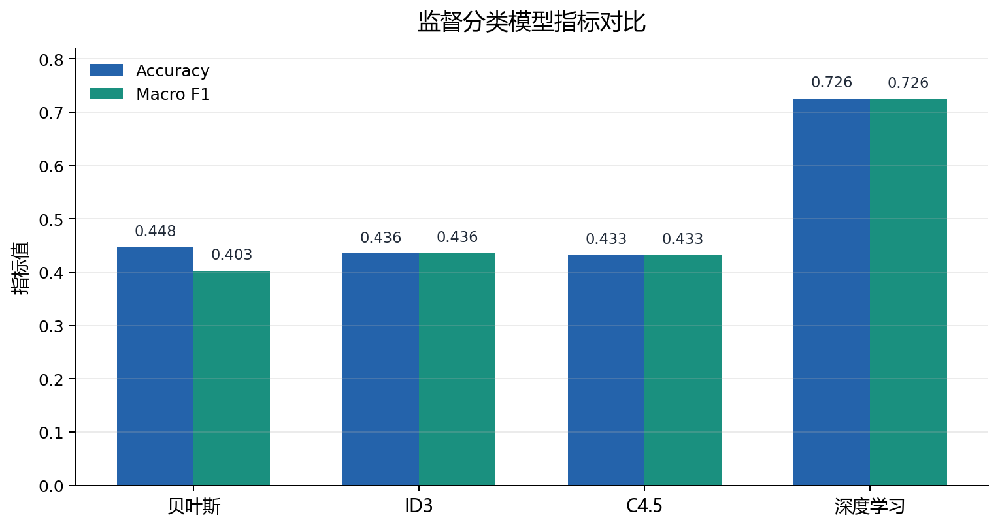

从指标看，贝叶斯、ID3 和 C4.5 的准确率都在 0.43 到 0.45 之间。这个结果并不意外，NBA 位置之间存在连续过渡，单纯依赖条件独立假设或单棵树规则会比较吃力。K-Means 可以看到一些数据结构，但聚类与真实位置标签的对应关系较弱。第五个深度学习模型没有使用球员姓名、球队或历史位置，Accuracy 和 Macro F1 均在 0.726 左右，是这组实验里结果最高的一种方法。这个结果应理解为综合建模流程的效果，而不是单个神经网络结构单独带来的结果。

---

# 实验一 贝叶斯分类

## 1. 实验基本信息

实验名称：基于 Gaussian Naive Bayes 的 NBA 球员位置分类<br>
实验日期：2026 年 6 月 14 日<br>
实验地点：本地 Windows / Anaconda 实验环境<br>
实验脚本：`experiments/experiment1_bayes.py`<br>
结果目录：`results/experiment1_bayes/`

## 2. 实验目标和实验环境

本实验目标是使用朴素贝叶斯分类器完成 NBA 球员位置预测，掌握贝叶斯分类的基本思想，并分析条件独立假设在真实体育统计数据上的局限。实验使用清洗后的 26 维原始数值特征，训练集和测试集与其他基础监督实验保持一致。

实验环境包括 Python、pandas、NumPy、scikit-learn 和 matplotlib。模型实现使用 `sklearn.naive_bayes.GaussianNB`。为了形成清晰对照，本实验最终保留基础 GaussianNB 方法，不加入额外特征工程、集成学习或复杂参数搜索。

## 3. 实验内容

基础方法采用 Gaussian Naive Bayes。该方法假设在给定类别条件下，各个特征相互独立，并且连续特征服从高斯分布。对于本实验，模型根据五个位置类别分别估计每个数值特征的均值和方差，然后对测试样本计算其属于各个位置的后验概率，选择概率最大的类别作为预测结果。

GaussianNB 本身会为每个类别估计各特征的均值和方差，不像 K-Means 那样直接依赖欧氏距离，因此本实验没有专门对贝叶斯输入做标准化。这样处理可以保留原始统计量的含义。不过，这也带来一个问题：如果某些字段的分布明显偏离高斯分布，或者多个字段之间相关性较强，模型的概率估计就会受到影响。

在实验过程中，我也对贝叶斯模型做了工程化整理，包括输出完整预测文件、分类报告、混淆矩阵、各类别指标图和预测分布图。贝叶斯模型本身没有增加复杂处理，这是因为课程实验要求中贝叶斯实验的重点是理解朴素贝叶斯原理，而不是用其他模型抬高它的结果。

## 4. 实验步骤和结果

实验流程比较直接：读取 `processed/nba_clean_train.csv` 和 `processed/nba_clean_test.csv`，提取 26 维原始数值特征作为输入，`Pos` 作为标签。这里没有把后续工程特征带入贝叶斯模型，目的是保留基础算法本身的表现。模型训练完成后在测试集上预测，再计算 Accuracy、Precision、Recall、F1，并保存混淆矩阵和可视化图片，方便检查错误主要集中在哪些类别。

主要指标如下。

| 指标 | 数值 |
|---|---:|
| Accuracy | 0.4477 |
| Macro Precision | 0.4752 |
| Macro Recall | 0.4480 |
| Macro F1 | 0.4027 |
| Weighted F1 | 0.4019 |

各类别 F1 表现如下。

| 位置 | Precision | Recall | F1 |
|---|---:|---:|---:|
| C | 0.4188 | 0.8353 | 0.5579 |
| PF | 0.5179 | 0.1470 | 0.2290 |
| PG | 0.4393 | 0.7510 | 0.5543 |
| SF | 0.4973 | 0.2591 | 0.3407 |
| SG | 0.5027 | 0.2476 | 0.3318 |

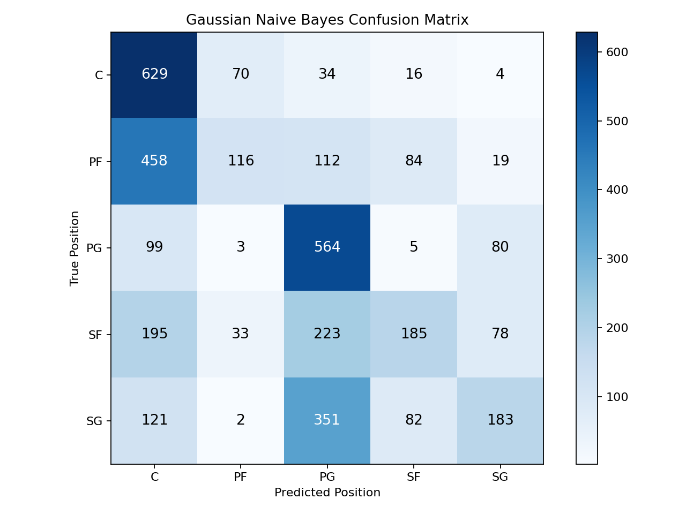

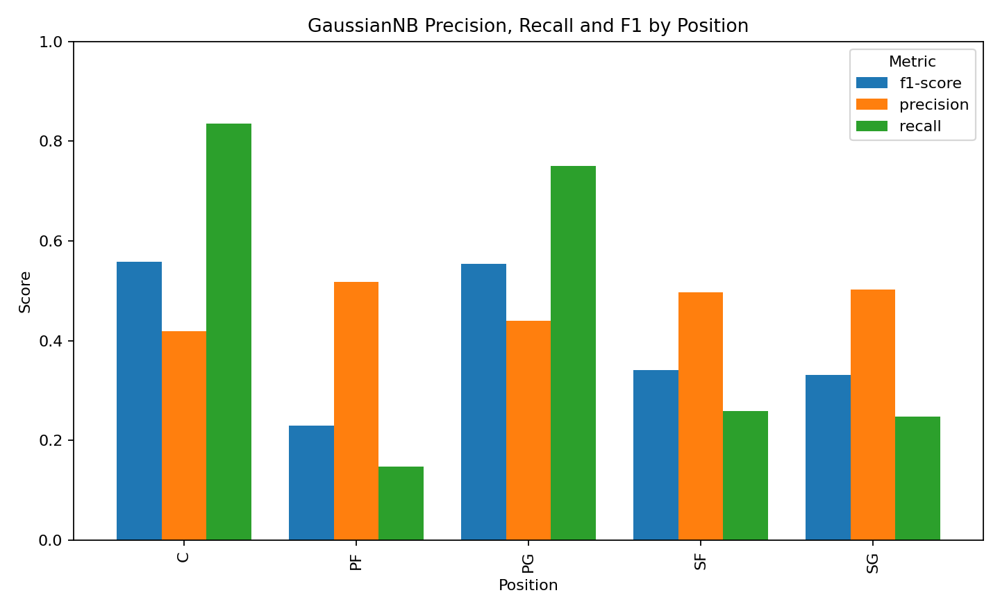

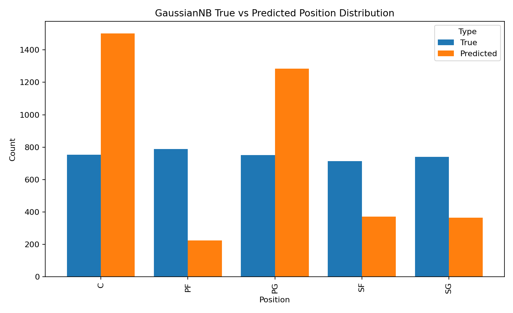

从结果看，贝叶斯模型对 `C` 和 `PG` 的召回率较高，分别达到 0.8353 和 0.7510；但 `PF`、`SF`、`SG` 的 F1 都偏低。混淆矩阵中可以看到，模型容易把不少样本集中预测到部分类别，特别是相邻位置之间区分不够细。这一点和朴素贝叶斯的假设有关：它把各技术统计近似看作条件独立，而实际数据里很多指标是同时变化的。

## 5. 结论与讨论

GaussianNB 的好处是训练快、实现简单，作为第一个监督分类基线比较合适。它的问题也暴露得很直接：NBA 技术统计之间存在较强相关性，例如出场时间、出手数、得分、篮板和助攻往往不是独立变化的。GaussianNB 的条件独立假设和高斯分布假设在这个任务上较难完全满足，因此 Macro F1 停在 0.4027。

这组实验让我先确认了基础概率模型的边界。对结构简单、特征关系不强的数据，朴素贝叶斯可能会有不错表现；但 NBA 位置预测受多项统计共同影响，只靠单独估计每个特征的类别分布，确实很难把相邻位置分开。

---

# 实验二 K-Means算法

## 1. 实验基本信息

实验名称：基于 K-Means 的 NBA 球员技术统计聚类<br>
实验日期：2026 年 6 月 14 日<br>
实验地点：本地 Windows / Anaconda 实验环境<br>
实验脚本：`experiments/experiment2_kmeans.py`<br>
结果目录：`results/experiment2_kmeans/`

## 2. 实验目标和实验环境

本实验目标是使用 K-Means 聚类算法对 NBA 球员赛季统计进行无监督分组，观察技术统计空间中的自然簇结构，并分析聚类结果与真实位置标签之间的关系。实验使用标准化后的 26 维原始数值特征，数据文件为 `processed/nba_scaled.csv`。

实验环境包括 Python、pandas、NumPy、scikit-learn 和 matplotlib。模型使用 `sklearn.cluster.KMeans`，同时使用 PCA 进行二维可视化，使用轮廓系数、ARI、NMI、簇-位置交叉表等指标分析聚类质量。

## 3. 实验内容

基础方法为 K-Means，设置 `k=5`，对应五个目标位置类别。K-Means 不使用真实标签训练，只根据样本之间的距离将数据划分为五个簇。由于不同统计字段量纲不同，实验使用标准化数据，避免大尺度特征主导欧氏距离。需要注意的是，轮廓系数不一定会支持 `k=5` 是最佳聚类数；这里仍然选择 `k=5`，主要是为了和五个真实位置类别进行对照分析。

在基础 K-Means 之外，我增加了若干分析步骤：使用肘部法和轮廓系数观察不同 k 值下的聚类效果；使用 PCA 将高维特征投影到二维平面；构造簇与真实位置的交叉表和比例热力图；通过多数类映射计算聚类与真实标签的粗略对应程度。这些处理没有改变 K-Means 算法本身，主要是为了把聚类结果看得更清楚。

## 4. 实验步骤和结果

实验读取标准化后的全量数据，以 26 维特征输入 K-Means。训练前先在不同 k 值下计算 inertia 和 silhouette score，用于观察聚类数选择；正式实验设置 `k=5`，对应五个位置类别。训练后保存每个样本的簇编号，并计算 Adjusted Rand Index、Normalized Mutual Information 和多数类映射准确率，用来比较聚类结果与真实位置之间的关系。

主要指标如下。

| 指标 | 数值 |
|---|---:|
| k | 5 |
| Inertia | 207340.1249 |
| Silhouette Score | 0.2071 |
| Adjusted Rand Index | 0.0166 |
| Normalized Mutual Information | 0.0509 |
| Majority Mapping Accuracy | 0.2521 |

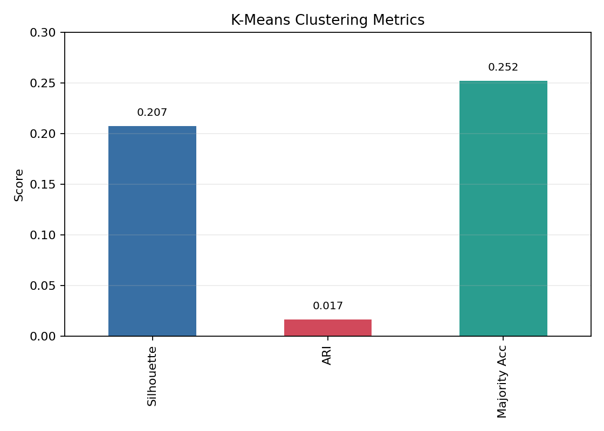

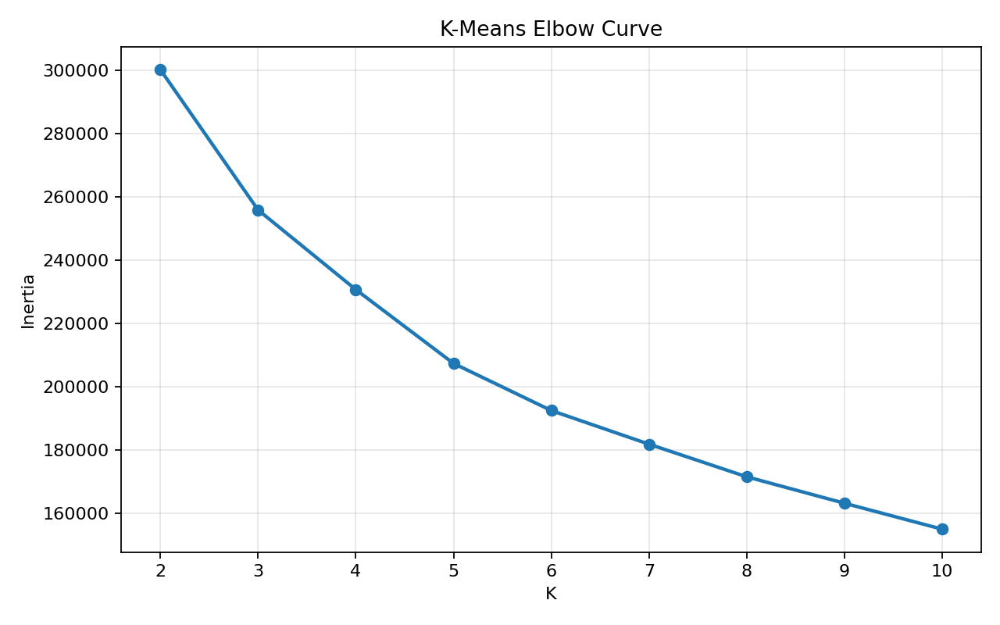

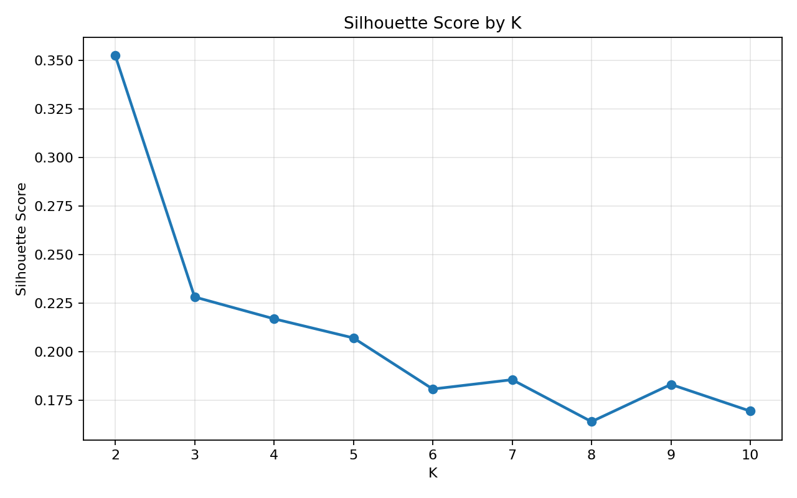

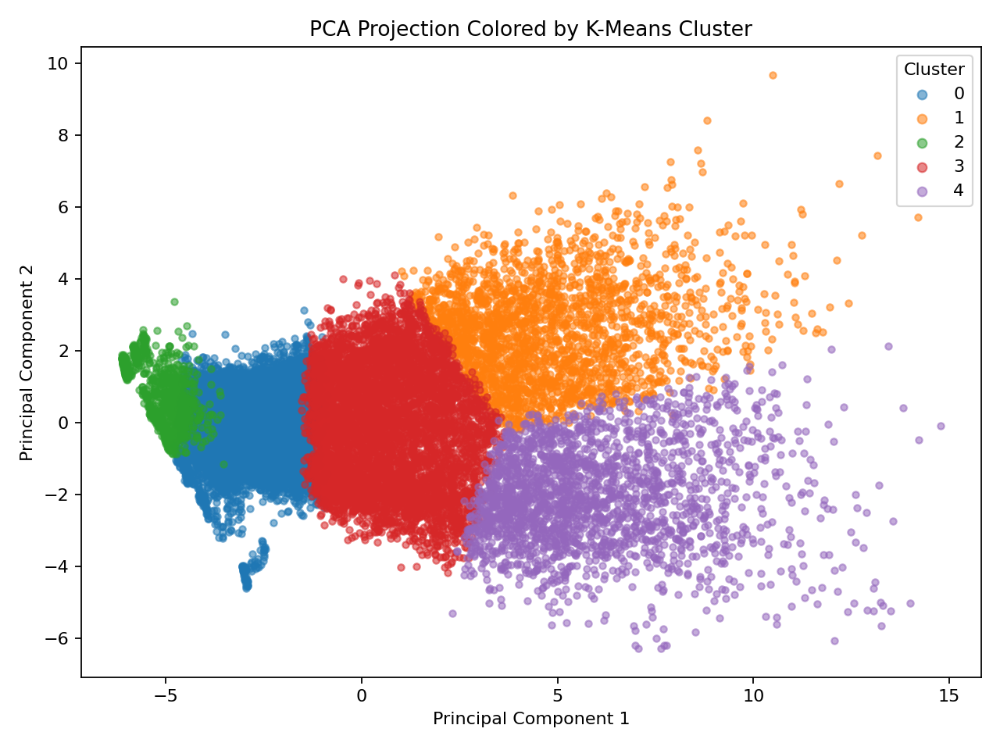

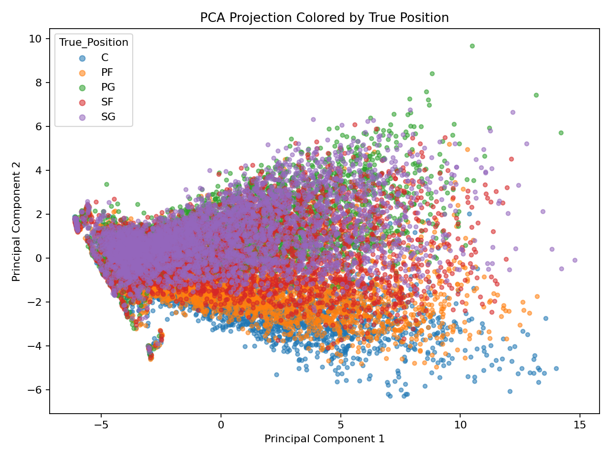

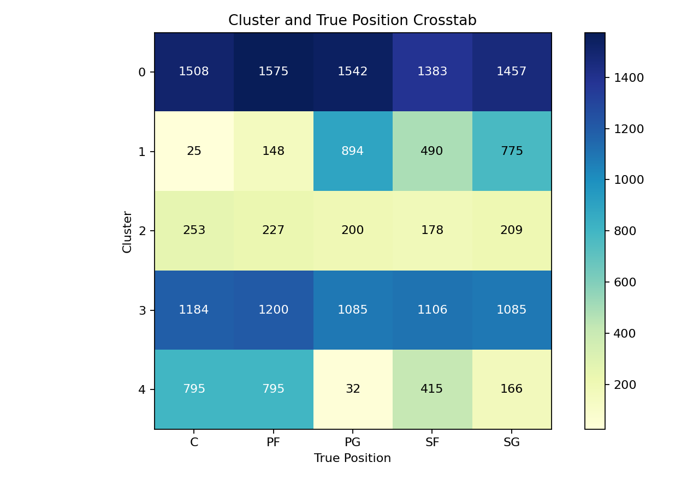

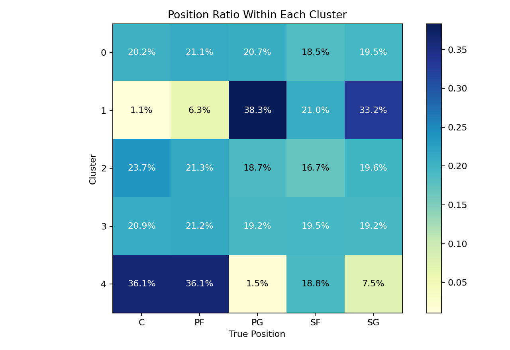

从 PCA 图和热力图看，K-Means 能够根据部分技术风格形成簇，但这些簇与真实位置并不一一对应。真实位置 PCA 图中五个位置在二维投影里大量交叠，簇-位置比例热力图也显示单个簇内部通常混有多个真实位置。多数类映射准确率只有 0.2521，ARI 接近 0，说明单纯依靠无监督距离聚类，很难直接恢复 NBA 位置标签。

## 5. 结论与讨论

K-Means 更适合做数据结构探索。它可以反映部分技术统计上的相似性，例如高篮板内线、外线后卫或高出场时间球员可能在特征空间中聚集。但 NBA 球员位置并不是由欧氏距离自然切开的五个圆形簇，位置之间存在连续过渡，特别是 `PF/SF`、`SG/SF`、`C/PF` 等边界比较模糊。

所以我没有把 K-Means 当成位置分类器使用，而是把它作为探索性分析工具。它给后续监督模型提供了一个直观参照：只看样本距离结构不够，位置预测仍然需要标签监督和更强的判别能力。

---

# 实验三 ID3分类算法

## 1. 实验基本信息

实验名称：基于 ID3 决策树的 NBA 球员位置分类<br>
实验日期：2026 年 6 月 14 日<br>
实验地点：本地 Windows / Anaconda 实验环境<br>
实验脚本：`experiments/experiment3_id3.py`<br>
结果目录：`results/experiment3_id3/`

## 2. 实验目标和实验环境

本实验目标是实现并应用 ID3 决策树分类算法，理解信息熵和信息增益在分类树构造中的作用。实验使用离散化后的 26 维原始数值特征，数据文件为 `processed/nba_discrete_train.csv` 和 `processed/nba_discrete_test.csv`。

实验环境包括 Python、pandas、NumPy 和 matplotlib。ID3 使用自定义递归实现，而不是直接调用 scikit-learn 的决策树模型。这样可以更清楚地控制信息增益计算、节点划分、叶节点生成和树结构统计。

## 3. 实验内容

基础方法为 ID3。ID3 以信息增益作为特征选择标准，每次选择能最大程度降低类别不确定性的特征进行划分。由于 ID3 原始算法主要适用于离散属性，本实验先对连续数值特征进行离散化，再输入 ID3 模型。离散化采用分位数分箱，通常将连续字段划分为 `low / mid / high` 三档；如果字段唯一值不足三档，则按实际可划分档数处理。选择分位数分箱的原因是各特征分布差异较大，等宽分箱容易让样本集中到某一档，分位数分箱能让每个区间的样本数量更均衡。

实验过程中也参考了 ID3 决策树课程材料，对信息熵、条件熵、信息增益和递归建树流程进行了整理，并增加了特征使用次数统计、预测分布、混淆矩阵和树结构统计。为了满足最终实验要求，ID3 最终保留基础算法版本，不加入剪枝、集成学习、特征增强或连续阈值搜索。

## 4. 实验步骤和结果

实验步骤包括读取离散化训练集、计算每个候选特征的信息增益、递归建立决策树、在测试集上逐条预测，并保存树结构、预测结果和评价指标。树结构统计如下：节点数为 11846，叶节点数为 6727，最大深度为 19。

主要指标如下。

| 指标 | 数值 |
|---|---:|
| Accuracy | 0.4357 |
| Macro Precision | 0.4374 |
| Macro Recall | 0.4354 |
| Macro F1 | 0.4360 |
| Weighted F1 | 0.4362 |
| Node Count | 11846 |
| Leaf Count | 6727 |
| Max Depth | 19 |

各类别 F1 如下。

| 位置 | Precision | Recall | F1 |
|---|---:|---:|---:|
| C | 0.4878 | 0.5299 | 0.5080 |
| PF | 0.3482 | 0.3460 | 0.3471 |
| PG | 0.6177 | 0.5659 | 0.5907 |
| SF | 0.3448 | 0.3375 | 0.3411 |
| SG | 0.3884 | 0.3978 | 0.3930 |

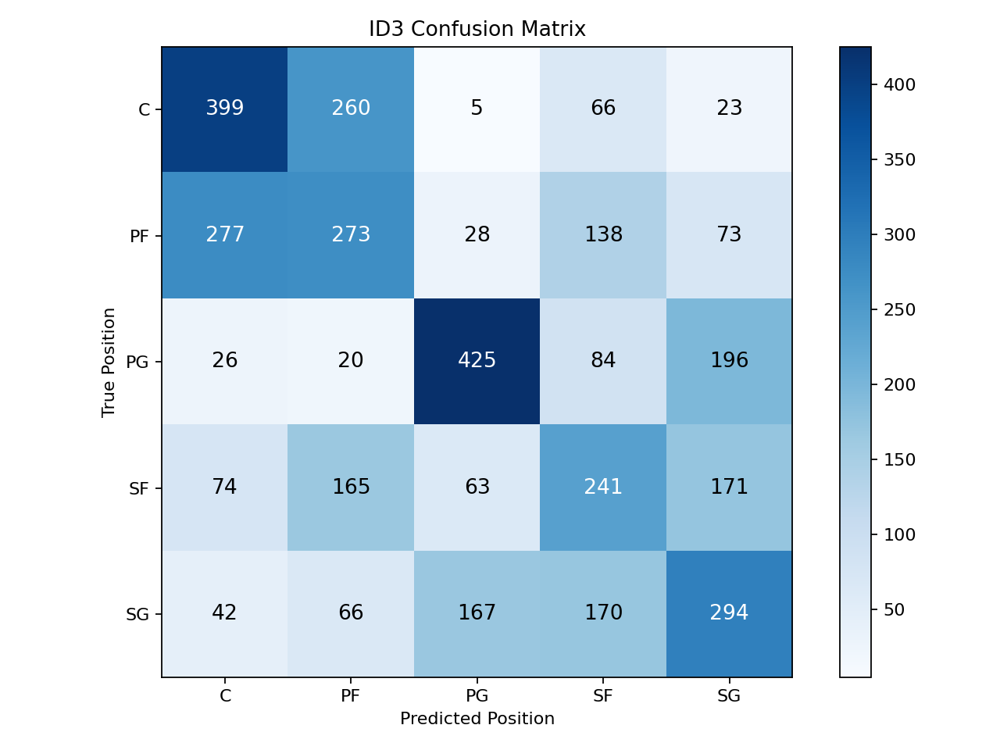

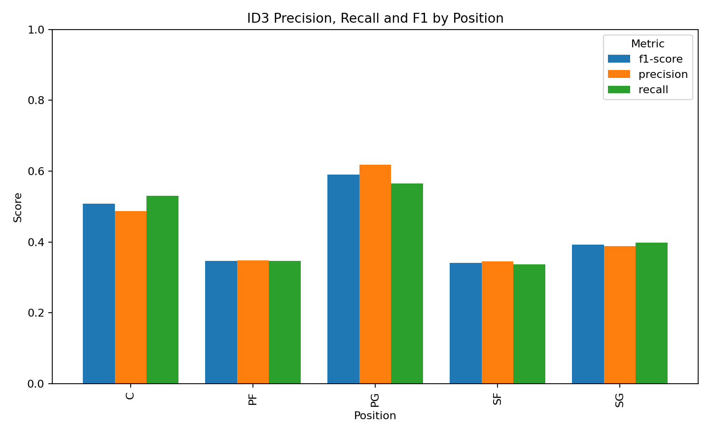

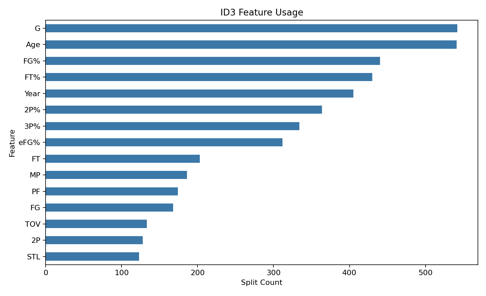

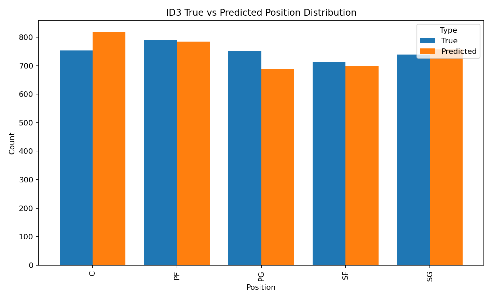

从测试结果看，ID3 的 Macro F1 为 0.4360，比贝叶斯高一些，但 Accuracy 仍只有 0.4357。`PG` 和 `C` 的识别效果相对好，`PF`、`SF`、`SG` 的指标偏低。单棵离散决策树能形成规则，但遇到相邻位置的连续边界时，规则会变得很碎，预测效果也不稳定。

## 5. 结论与讨论

ID3 比较适合观察规则。通过树节点和特征使用情况，可以看到模型确实在某些统计字段上形成了明确划分。但它的限制也比较明显：连续特征离散化后会损失数值细节，信息增益容易偏向某些划分结果，单棵树对局部划分很敏感。树的最大深度达到 19，叶节点数达到 6727，也说明模型为了拟合训练数据生成了比较复杂的结构，存在一定过拟合风险。

这一实验让我看到，决策树可以把数据转成规则，但规则清楚不等于测试集指标一定高。后续 C4.5 会改用信息增益率，不过如果仍然限制在基础单树和离散化原始特征上，能带来的变化不会太大。

---

# 实验四 C4.5分类算法

## 1. 实验基本信息

实验名称：基于 C4.5 决策树的 NBA 球员位置分类<br>
实验日期：2026 年 6 月 14 日<br>
实验地点：本地 Windows / Anaconda 实验环境<br>
实验脚本：`experiments/experiment4_c45.py`<br>
结果目录：`results/experiment4_c45/`

## 2. 实验目标和实验环境

本实验目标是实现 C4.5 分类算法，理解信息增益率对 ID3 信息增益准则的改进。实验继续使用离散化后的 26 维原始数值特征，保持与 ID3 相同的数据划分和评价方式，以便比较两种决策树算法的差异。

实验环境包括 Python、pandas、NumPy 和 matplotlib。C4.5 同样使用自定义递归实现，核心划分准则由信息增益改为信息增益率。

## 3. 实验内容

基础方法为 C4.5。C4.5 在 ID3 的基础上使用信息增益率作为划分依据，用分裂信息对信息增益进行归一化，从而缓解 ID3 偏向多取值特征的问题。这里实现的是课程实验中的基础 C4.5 思路，重点放在信息增益率划分准则上，并不是完整工业版 C4.5：没有加入剪枝，也没有直接对连续特征做节点级阈值搜索，而是沿用与 ID3 相同的离散化输入。

本实验与 ID3 的主要差别在划分准则：C4.5 不只看信息增益绝对值，还会考虑划分本身带来的分裂复杂度。实验同样输出特征使用统计、混淆矩阵、类别指标和预测分布可视化。按照最终要求，C4.5 仍保留基础单树版本，不加入剪枝、随机森林或额外深度学习模型。

## 4. 实验步骤和结果

实验读取离散化数据后，递归计算每个候选特征的信息增益率，并选择最高者进行节点划分。模型训练完成后，在测试集上进行预测。树结构统计如下：节点数为 11802，叶节点数为 6638，最大深度为 26。

主要指标如下。

| 指标 | 数值 |
|---|---:|
| Accuracy | 0.4327 |
| Macro Precision | 0.4341 |
| Macro Recall | 0.4323 |
| Macro F1 | 0.4328 |
| Weighted F1 | 0.4332 |
| Node Count | 11802 |
| Leaf Count | 6638 |
| Max Depth | 26 |

各类别 F1 如下。

| 位置 | Precision | Recall | F1 |
|---|---:|---:|---:|
| C | 0.5056 | 0.5432 | 0.5237 |
| PF | 0.3579 | 0.3574 | 0.3576 |
| PG | 0.5939 | 0.5433 | 0.5675 |
| SF | 0.3458 | 0.3375 | 0.3416 |
| SG | 0.3673 | 0.3802 | 0.3737 |

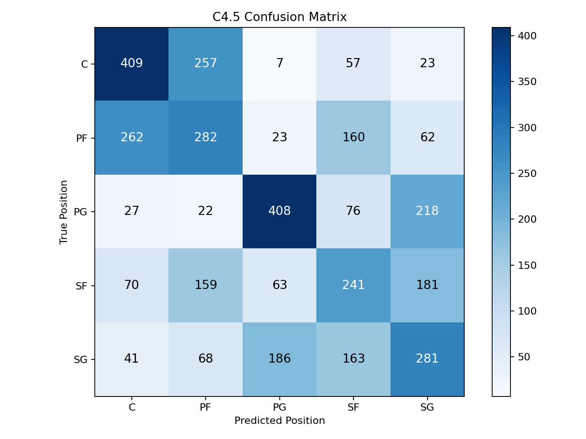

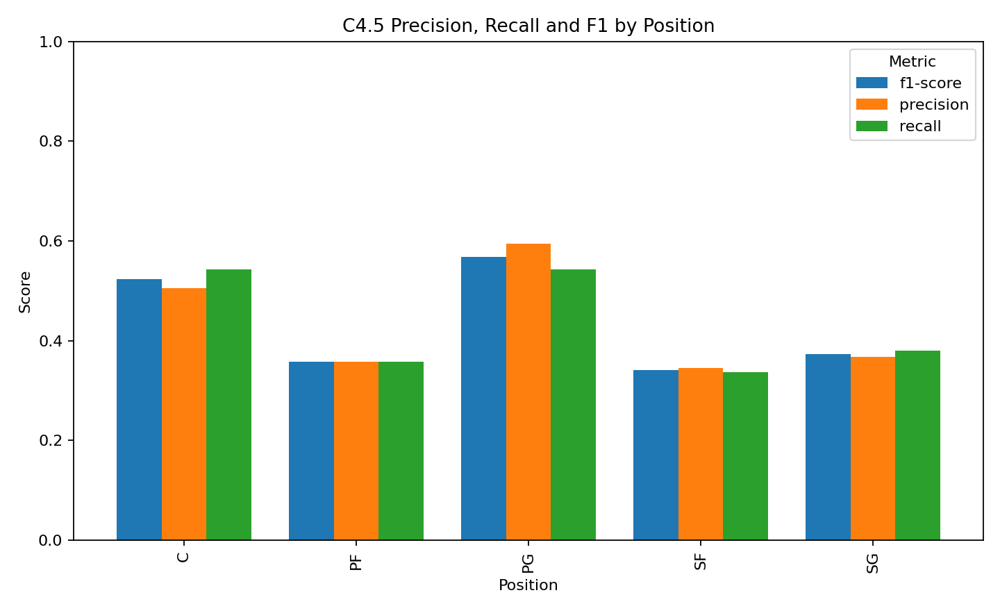

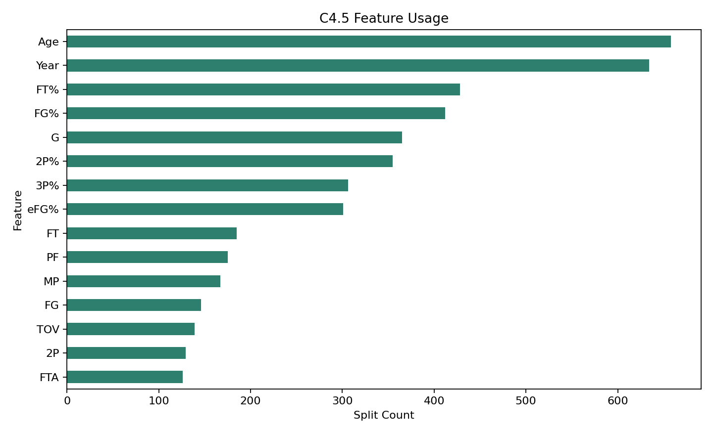

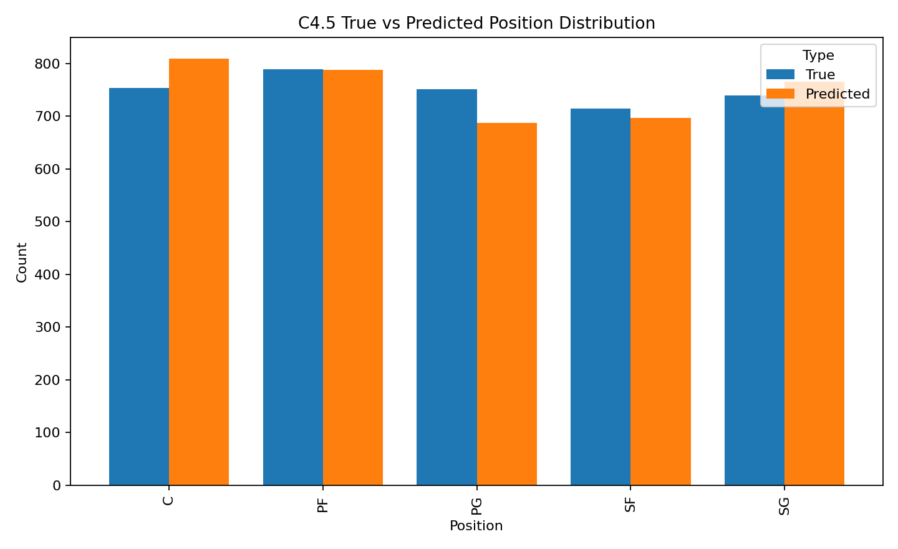

从结果看，C4.5 与 ID3 没有拉开差距，Accuracy 为 0.4327，Macro F1 为 0.4328，略低于 ID3 的 0.4360。信息增益率在理论上能缓解 ID3 偏向多取值特征的问题，但这里输入仍是离散化后的 26 维原始特征，模型也仍是一棵树，所以测试集表现变化不大。

## 5. 结论与讨论

C4.5 相比 ID3 的算法变化是划分准则更谨慎，能够减少多取值特征带来的偏置。在本实验中，C4.5 对 `C` 和 `PG` 仍有一定识别能力，但 `PF`、`SF`、`SG` 的边界混淆明显。这个结果说明，在 NBA 位置预测这种连续、重叠、多因素共同决定的任务里，只改一棵树的划分准则还不够。

这里比较有价值的一点是：算法准则变得更合理，并不一定马上反映为更高的测试指标。对复杂表格分类问题，单树模型的表达能力本身有限，后面需要尝试特征工程、集成模型和非线性模型，才能继续打开空间。

---

# 实验五 深度神经网络算法应用

## 1. 实验基本信息

实验名称：基于深度神经网络与概率融合的 NBA 球员位置分类<br>
实验日期：2026 年 6 月 22 日<br>
实验地点：本地 Windows / Anaconda / PyTorch GPU 实验环境<br>
实验脚本：`experiments/experiment5_dnn.py`，`experiments/experiment5_ablation.py`<br>
结果目录：`results/experiment5_dnn/`，`results/experiment5_feature_selection_search/`，`results/experiment5_ablation/`

## 2. 实验目标和实验环境

实验五放在报告的重点位置。这个实验仍然只使用合规数据，不使用 `Player`、`Tm`、历史位置和球队信息；在此前提下，我尝试把 26 维原始统计扩展为技术统计工程特征，再用深度神经网络处理相邻位置之间的非线性边界。后续加入 DNN 集成、年代专家和 ExtraTrees 概率融合，主要是为了解决单次训练波动和不同模型判断角度不一致的问题。

实验环境为 Python、pandas、NumPy、scikit-learn、matplotlib、PyTorch。GPU 环境可用，设备为 `NVIDIA GeForce RTX 4060 Laptop GPU`，PyTorch 使用 CUDA 训练。训练过程中使用 AdamW、CosineAnnealingLR、BatchNorm、Dropout、label smoothing 和监督对比学习。

数据划分上，实验仍沿用统一的训练集和测试集。正式测试集只在最终评估时使用，不参与特征筛选和权重选择。训练阶段又从训练集中划出验证集，用于比较网络配置、观察融合权重和筛选特征子集。这样做的原因是，深度学习模型可调部分较多，如果直接根据测试集反复调参，测试集指标就会失去参考价值。

| 数据部分 | 样本量 | 用途 |
|---|---:|---|
| 训练子集 | 11984 | 网络配置比较、模型训练 |
| 验证子集 | 2997 | 参数选择、特征子集比较、融合权重观察 |
| 最终训练集 | 14981 | 确定方案后重新训练正式模型 |
| 测试集 | 3746 | 只用于最终评价 |

标准化也只在训练数据上拟合。具体做法是使用 `StandardScaler` 计算训练集各特征的均值和标准差，再用同一组参数转换验证集和测试集。这样可以避免验证集或测试集的统计信息提前进入模型。对于 DNN 来说，这一步比较关键，因为出场时间、得分、篮板、命中率等变量的量纲差别较大，如果不标准化，梯度更新会被大尺度特征影响。

## 3. 实验内容

### 3.1 基础深度学习方法

基础版本可以理解为使用标准化后的技术统计特征训练单个 Residual DNN。该模型输入球员特征向量，经过全连接层和残差块，输出五个位置的概率。相比前四个基础模型，Residual DNN 不需要把特征关系写成固定规则，可以从数据中学习多个指标之间的组合关系，例如助攻、三分出手、篮板、盖帽、每 36 分钟数据和投篮结构共同决定位置倾向。

在调参过程中发现，单个 Residual DNN 已经高于单棵树和朴素贝叶斯，但不同随机种子会带来一定波动，不同年代的打法差异也会影响判断。相邻位置仍然是主要难点，所以后面没有只依赖一个网络，而是继续加入几个可单独验证的模块。

### 3.2 45维输入特征

实验最初构造了 76 维候选特征，其中包括 26 维原始数值特征和 50 维工程特征。工程特征包括场均指标、每 36 分钟指标、投篮结构比例、篮板比例、组织效率指标、防守倾向指标和相邻位置分离指标。中间探索阶段曾保留过 59 维核心特征，但最终模型统一采用 45 维 `separation_core_45` 版本。消融实验沿用 PPT 中已经整理好的固定结果，用于说明各模块贡献，不再重新调整。

特征筛选主要在训练集内部和验证集上比较完成，测试集不参与特征选择。最终选择 `separation_core_45` 作为正式输入特征，该特征集由 17 维原始特征和 28 维工程特征组成。相比 76 维全量候选特征，45 维版本减少 31 个特征，降幅约 40.8%；最终测试集 Accuracy 为 0.7261，Macro F1 为 0.7258。这个结果说明，删去一部分重复或弱相关特征后，主要位置信息没有明显损失。

特征筛选不是简单按数量越少越好，而是在几个候选集合之间比较。筛选时我主要保留三类信息：一是原始统计中和位置相关较强的字段，例如篮板、助攻、抢断、盖帽、犯规；二是把总量转成场均或每 36 分钟后的效率字段，减少出场场次差异带来的影响；三是专门针对相邻位置构造的分离字段，例如 `Center_PF_Separation`、`SG_PG_Separation`、`SF_PF_Separation`。下表是确定方案后在同一测试集上的复现实验对照，用来展示不同特征集合的表现差异，不作为反复调参依据。

| 特征集合 | 特征数 | Accuracy | Macro F1 | 观察 |
|---|---:|---:|---:|---|
| separation_core_45 | 45 | 0.7261 | 0.7258 | 最终报告采用，维度较少且指标最高 |
| separation_plus_all_profiles_54 | 54 | 0.7226 | 0.7227 | 增加更多画像特征后没有继续变好 |
| separation_plus_usage_52 | 52 | 0.7205 | 0.7202 | 使用率相关特征增加后略低 |
| domain_compact_42 | 42 | 0.7173 | 0.7170 | 维度更少，但开始损失部分信息 |
| importance_top_35 | 35 | 0.7157 | 0.7158 | 过度压缩后分类边界变弱 |

主要特征类别如下。

| 类别 | 示例 | 作用 |
|---|---|---|
| 基础出场和效率 | Year, Age, G, MP, FG%, 3P%, eFG%, FT% | 描述赛季背景、出场规模和投篮效率 |
| 场均贡献 | PPG, MPG, RPG, APG, SPG, BPG | 降低总量受出场场次影响的问题 |
| 每36分钟指标 | PTS_36, TRB_36, AST_36, STL_36, BLK_36 | 在相近时间尺度下比较球员 |
| 投篮结构 | ThreePAr, FTr, 3PA_36, FTA_36 | 描述外线倾向和造犯规能力 |
| 组织与防守 | AST_TOV, PF_36, STL_36, BLK_36 | 描述组织效率、防守方式和对抗特征 |
| 位置分离 | Center_PF_Separation, SG_PG_Separation, SF_PF_Separation | 缓解相邻位置混淆 |

最终 45 维特征中，原始特征包括 `Year`、`Age`、`G`、`MP`、`FG%`、`3P%`、`2P%`、`eFG%`、`FT%`、`ORB`、`DRB`、`TRB`、`AST`、`STL`、`BLK`、`TOV`、`PF`。工程特征包括 `PPG`、`MPG`、`RPG`、`APG`、`SPG`、`BPG`、`TPG`、`FPG`、`ThreePAr`、`FTr`、`AST_TOV`、`ORB_Ratio`、`DRB_Ratio`、每 36 分钟指标，以及几个位置分离指标。这样设计后，模型既能看到原始统计，也能看到更接近篮球语义的比例和效率。

部分工程特征公式如下。这些公式基本围绕“单位时间贡献”“投篮结构”“组织失误比”和“内外线倾向”构造。

```text
PPG = PTS / G
RPG = TRB / G
APG = AST / G
PTS_36 = PTS / MP × 36
TRB_36 = TRB / MP × 36
ThreePAr = 3PA / FGA
FTr = FTA / FGA
AST_TOV = AST / TOV
```

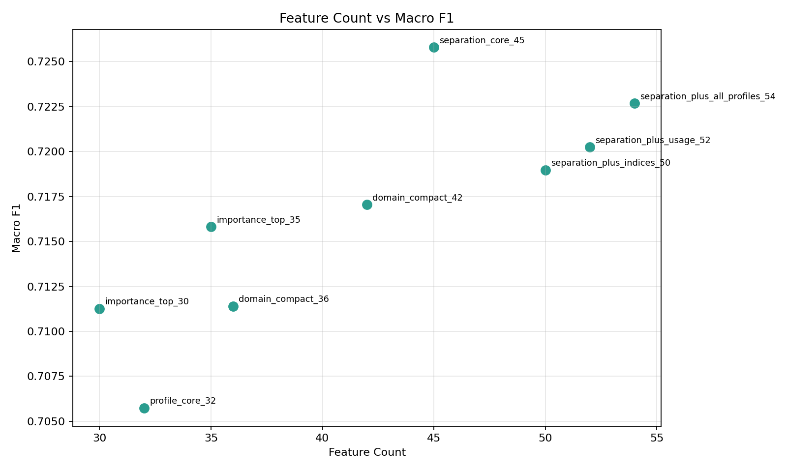

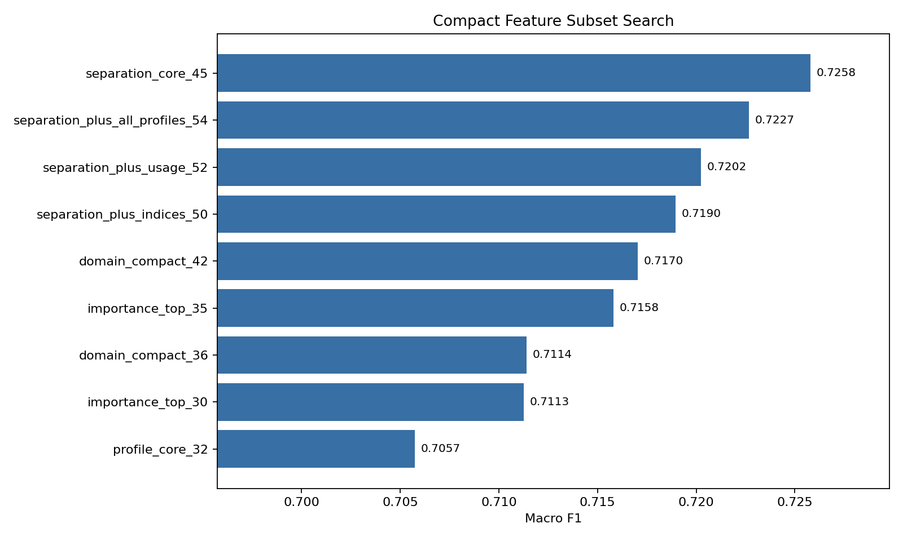

### 3.3 Residual DNN主模型

深度学习主干模型为 `ResidualPositionNet`，即残差全连接神经网络。模型结构为：

```text
45维输入特征
→ 输入层 45 → 192
→ Residual Block × 2
→ 分类层 192 → 5
→ Softmax五类位置概率
```

每个残差块内部包含 Linear、BatchNorm、激活函数、Dropout、Linear 和 BatchNorm，并使用 `x + F(x)` 形式的残差连接。残差连接的作用是保留已有表示，再学习需要补充的修正量；实际训练中，这比单纯堆叠全连接层更容易收敛。主要参数如下。

| 参数 | 取值 |
|---|---:|
| 输入维度 | 45 |
| 隐藏层宽度 | 192 |
| 残差块数量 | 2 |
| 输出维度 | 5 |
| Dropout | 0.15 |
| learning_rate | 8e-4 |
| weight_decay | 1e-4 |
| batch_size | 512 |

参数选择时没有直接使用最大网络。早期比较过几组全连接配置，验证集结果显示，较大的网络不一定更好。例如 `[512, 256, 128]` 的验证集 Macro F1 为 0.6826，低于 `[256, 128, 64]` 的 0.6899。后续正式模型采用宽度为 192、2 个残差块的结构，主要考虑是：参数量足够表达特征组合，同时不过度加深网络，训练速度和稳定性也比较合适。

| 验证配置 | hidden_layers | Dropout | learning_rate | best_epoch | 验证 Macro F1 |
|---|---|---:|---:|---:|---:|
| config 1 | [256, 128, 64] | 0.20 | 0.0010 | 70 | 0.6899 |
| config 2 | [384, 192, 96] | 0.20 | 0.0008 | 52 | 0.6881 |
| config 3 | [512, 256, 128] | 0.25 | 0.0007 | 36 | 0.6826 |

训练策略上，AdamW 用于控制权重衰减，CosineAnnealingLR 让学习率随 epoch 逐步下降。`Dropout = 0.15` 用来减少网络对少数特征组合的依赖，`label_smoothing = 0.02` 则让标签不要过于“硬”。篮球位置本身存在摇摆属性，例如一个球员可能在 SF 和 SG 之间切换，因此过硬的标签有时会让模型对边界样本过度自信。

### 3.4 监督对比学习模型

在普通 Residual DNN 之外，实验还训练了 `ContrastiveResidualPositionNet`。该模型在分类头之外增加 projection head，将 192 维隐藏表示映射到 64 维对比学习向量。训练损失为：

```text
总损失 = CrossEntropyLoss + 0.1 × SupervisedContrastiveLoss
```

交叉熵损失负责最终分类正确，监督对比损失负责让同类样本在隐藏空间中更接近、不同类样本更分开。该模块主要服务于 `C/PF`、`PF/SF`、`PG/SG`、`SF/SG` 等相邻位置边界。预测阶段只使用分类头输出的概率，projection head 不直接参与最终类别判断。

这里需要注意，监督对比学习不是单独拿来预测的模型，也不改变最终输出形式。它只是在训练隐藏层表示时增加一个约束，让同位置样本更靠近、不同位置样本更分开。最终测试时仍然看分类头输出的五类概率。当前保留的消融结果中，去掉监督对比损失后 Macro F1 下降约 0.0033；去掉 Contrastive DNN 成员后下降约 0.0049。这说明它属于辅助模块，对边界类别有帮助，但不是最终结果的主要来源。

### 3.5 DNN集成学习

最终全局 DNN 集成由两组模型组成：

```text
3个普通 ResidualPositionNet
3个 ContrastiveResidualPositionNet
```

每个模型都会输出五个位置的概率，最终对概率进行加权平均，得到 `global_probabilities`。这种方式属于集成学习。它不是硬投票，而是概率融合，可以保留不同模型对类别不确定性的判断。消融实验记录中，如果退化为单个 Residual DNN，Macro F1 下降约 0.0340，说明多个 DNN 成员的平均结果比单模型更可靠。

### 3.6 年代专家DNN

NBA 不同年代的位置打法存在差异。早期内线更偏篮下，现代内线可能具备三分和传球能力；后卫和锋线的职责也随时代变化。因此实验按 `Year` 将数据分为四个年代段：

| 年代桶 | 条件 | 说明 |
|---|---|---|
| era 0 | Year < 1990 | 1980s及以前 |
| era 1 | 1990 ≤ Year < 2000 | 1990s |
| era 2 | 2000 ≤ Year < 2010 | 2000s |
| era 3 | Year ≥ 2010 | 2010s及以后 |

每个年代训练 4 个 DNN 成员，包括 2 个普通 Residual DNN 和 2 个 Contrastive Residual DNN。预测时，样本根据 Year 匹配对应年代专家，得到 `era_probabilities`。年代专家与全局DNN的融合公式为：

```text
DNN最终概率 = 0.60 × global_probabilities + 0.40 × era_probabilities
```

实验中 `global_only_macro_f1 = 0.7001`，`era_only_macro_f1 = 0.7122`，二者融合后 DNN ensemble Macro F1 达到 0.7167。当前保留的消融结果显示，去掉年代专家后 Macro F1 下降约 0.0151。这个变化说明，按年代分开建模确实捕捉到了一部分打法变化，例如内线外线化、锋卫摇摆增多等现象。

年代专家的训练数据量如下。每个年代段都有一定样本量，没有出现某个专家完全缺少训练数据的情况。

| 年代桶 | 训练样本 | 测试样本 |
|---|---:|---:|
| era 0 | 3033 | 758 |
| era 1 | 3911 | 976 |
| era 2 | 4303 | 1045 |
| era 3 | 3734 | 967 |

### 3.7 ExtraTrees概率融合

实验还训练了 ExtraTrees 辅助模型。ExtraTrees 是多棵极端随机树的集成模型，适合表格数据。它单独使用 45 维特征得到 `Accuracy = 0.6909`，`Macro F1 = 0.6899`，低于 DNN，但高于前四个基础模型。原因在于 ExtraTrees 是多树集成，可直接处理连续数值特征，并且使用的是经过筛选的 45 维技术特征。

最终模型不是使用 ExtraTrees 替代 DNN，而是将其作为辅助概率来源。融合公式为：

```text
最终概率 = 0.55 × DNN概率 + 0.45 × ExtraTrees概率
```

其中 `0.45` 是通过验证集搜索确定的 ExtraTrees 权重，DNN 权重为 `1 - 0.45 = 0.55`。具体做法是在验证集上尝试 ExtraTrees 权重从 `0.00` 到 `0.50` 的若干取值，比较不同权重下的 Macro F1；验证探查中 `0.45` 对应的结果最好，因此测试阶段固定使用该权重。当前保留的消融结果显示，去掉 ExtraTrees 后 Macro F1 下降约 0.0091，说明树模型概率能给 DNN 结果提供补充。

最终预测流程可以写成下面的顺序：

```text
45维特征
→ StandardScaler标准化
→ 6个全局DNN成员输出 global_probabilities
→ 4组年代专家DNN输出 era_probabilities
→ 0.60 × global_probabilities + 0.40 × era_probabilities
→ ExtraTrees输出 auxiliary_tree_probabilities
→ 0.55 × DNN概率 + 0.45 × ExtraTrees概率
→ 选择概率最大的类别作为最终位置
```

这一流程看起来模块较多，但每一步都有对应的消融结果。全局 DNN 负责主要判断，年代专家处理年份差异，ExtraTrees 作为表格树模型提供另一种概率估计。融合阶段使用概率平均，而不是只取某个模型的硬分类结果，可以保留模型对边界样本的不确定性。

## 4. 实验步骤和结果

实验五的流程分为几个阶段。在清洗数据基础上构造 50 维工程特征，并与 26 维原始数值特征组成 76 维候选特征；再设计多个特征子集，用完整深度学习流程重新训练并比较，确定 45 维输入。DNN 输入使用 `StandardScaler` 标准化，标准化参数只在训练集上拟合，验证集和测试集只做 transform，避免数据泄露。模型训练部分包括全局 DNN 集成、年代专家 DNN 和 ExtraTrees 辅助模型，测试前再进行概率融合并输出预测结果。

最终指标如下。

| 指标 | 数值 |
|---|---:|
| Accuracy | 0.7261 |
| Macro Precision | 0.7257 |
| Macro Recall | 0.7260 |
| Macro F1 | 0.7258 |
| Weighted F1 | 0.7259 |
| Global DNN Macro F1 | 0.7001 |
| Era Expert Macro F1 | 0.7122 |
| DNN Ensemble Macro F1 | 0.7167 |
| ExtraTrees Macro F1 | 0.6899 |

模型演进过程如下。这里不是每一步都代表独立算法创新，而是记录从基础深度模型到最终融合方案的实验路径。

| 阶段 | 方法 | Macro F1 |
|---|---|---:|
| 基础 DNN | 单个 Residual DNN | 0.6972 |
| 全局 DNN 集成 | 3个 Residual DNN + 3个 Contrastive Residual DNN | 0.7001 |
| 加入年代专家 | Global DNN + Era Expert DNN | 0.7167 |
| 加入 ExtraTrees 融合 | DNN 概率 + ExtraTrees 概率 | 0.7258 |

各类别指标如下。

| 位置 | Precision | Recall | F1 |
|---|---:|---:|---:|
| C | 0.7653 | 0.7450 | 0.7550 |
| PF | 0.6574 | 0.6591 | 0.6582 |
| PG | 0.8505 | 0.8708 | 0.8605 |
| SF | 0.6583 | 0.6583 | 0.6583 |
| SG | 0.6969 | 0.6969 | 0.6969 |

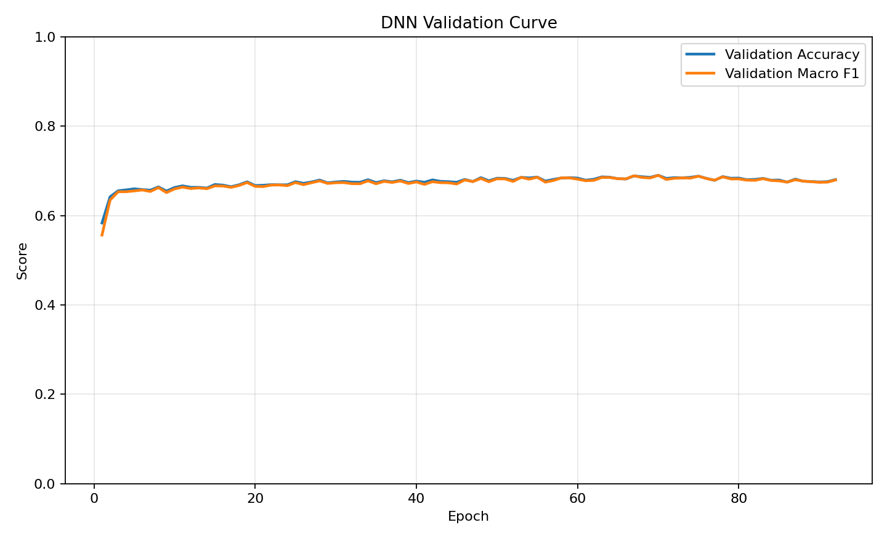

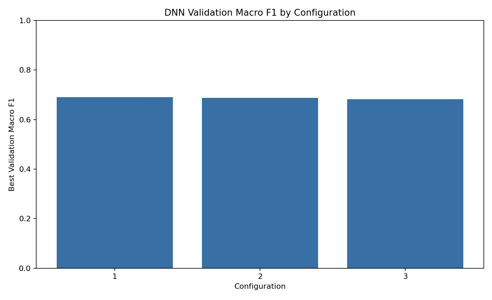

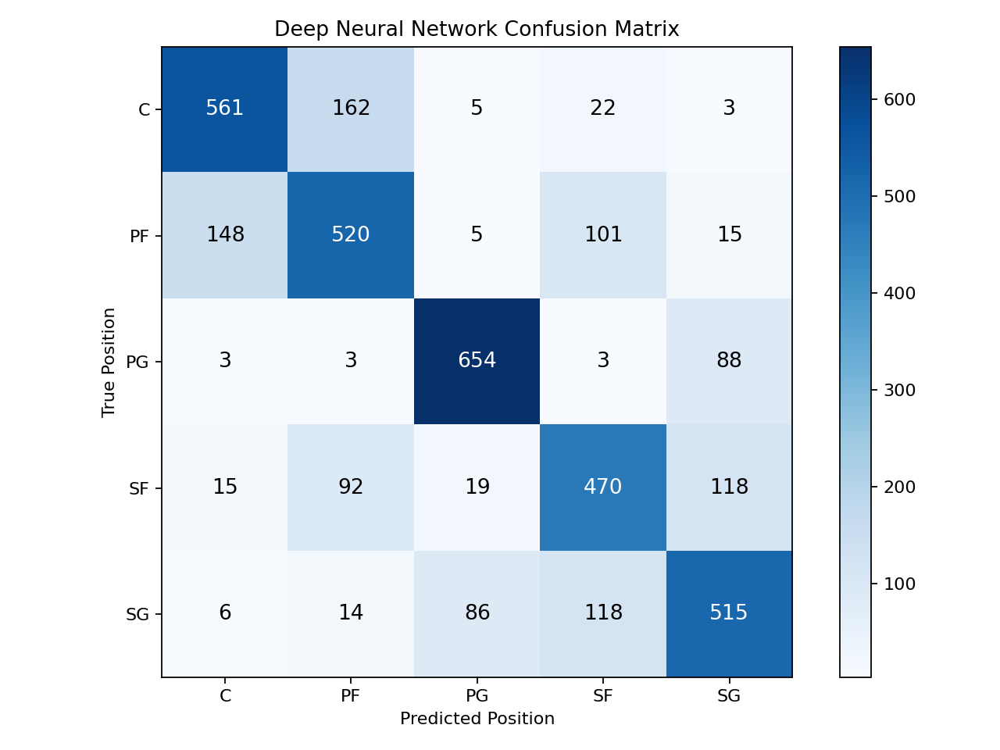

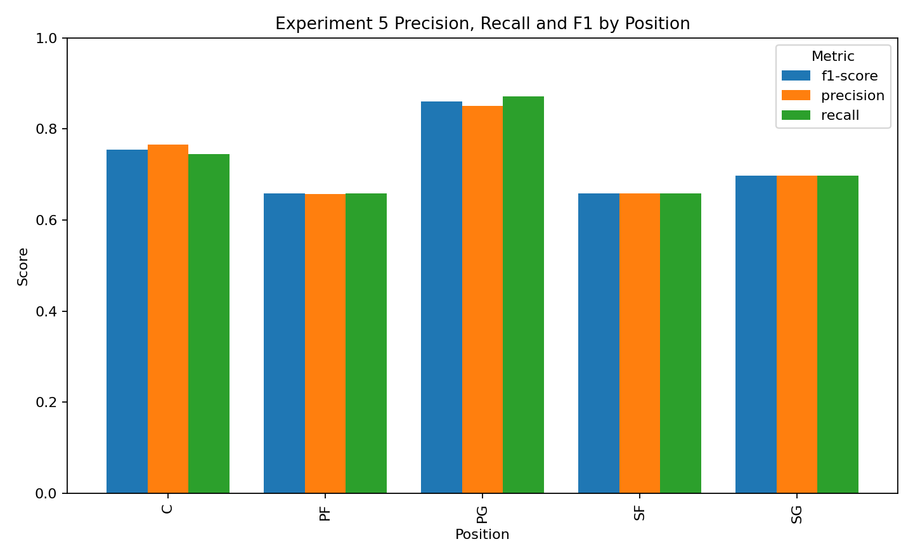

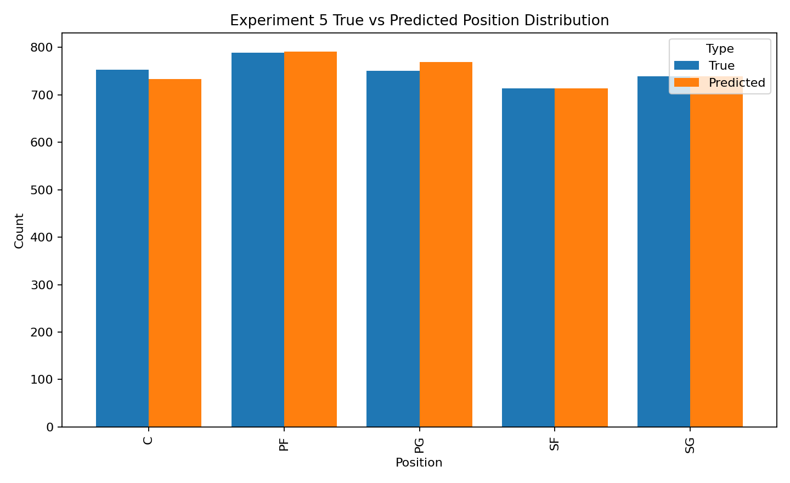

从类别指标看，`PG` 的 F1 达到 0.8605，是识别最稳定的类别；`C` 的 F1 为 0.7550，也相对较好。`PF`、`SF`、`SG` 的 F1 在 0.658 到 0.697 之间，主要原因是这些位置存在较多摇摆属性。混淆矩阵显示，主要错误集中在 `C/PF`、`SF/SG`、`PG/SG` 等相邻位置之间，这与篮球位置语义一致。

这些错误有比较清楚的篮球含义。`C/PF` 容易混淆，是因为两类球员都可能有较高篮板、盖帽、犯规和内线终结数据；`PF/SF` 的混淆主要来自锋线角色重叠，一些球员既有篮板和对抗，也有外线出手；`PG/SG` 的边界受双能卫影响，得分后卫可能有较多助攻，控球后卫也可能承担大量得分；`SF/SG` 则常见于外线投射和得分方式接近的球员。只靠赛季汇总技术统计，很难完全还原球员在比赛中的真实站位和战术角色。

训练曲线中可以看到，模型在前期收敛较快，后期验证指标变化趋于平缓。调参过程中我没有继续盲目加深网络，一方面是更深模型在验证集上没有表现出稳定优势，另一方面是当前数据本质上仍是表格统计数据，特征质量和融合策略比单纯增加层数更重要。

从预测分布看，深度学习模型没有像贝叶斯那样明显集中到少数类别，五类预测数量更接近真实分布。这个现象说明概率融合在一定程度上减少了单模型偏向，但也不能说明模型已经完全解决位置混淆问题。`PF`、`SF`、`SG` 的 F1 仍低于 `PG` 和 `C`，这是后续最值得继续处理的部分。

## 5. 结论与讨论

深度神经网络实验是本报告中工作量最大的一部分。相比前四个基础方法，它不是只调用一个模型，而是经历了数据特征构造、特征筛选、标准化处理、网络结构设计、训练策略选择、DNN 集成、年代专家建模、概率融合和消融实验验证。

消融实验结果如下。

| 消融项 | Macro F1下降 | 说明 |
|---|---:|---|
| 只用ExtraTrees，不使用DNN | 0.0359 | DNN主干仍是主要判断来源 |
| 退化为单个Residual DNN | 0.0286 | 多个DNN成员平均后结果更稳 |
| 去掉工程特征，只保留26维原始特征 | 0.0226 | 工程特征提供了更直接的技术画像 |
| 去掉年代专家 | 0.0151 | 年代差异对位置判断有贡献 |
| 去掉ExtraTrees融合 | 0.0091 | 树模型概率带来补充 |
| 去掉Contrastive DNN成员 | 0.0049 | 对比学习成员提供了不同的概率判断 |
| 使用全部76维特征而非45维筛选特征 | 0.0046 | 45维特征在简洁性上更优 |
| 去掉监督对比损失 | 0.0033 | 对比损失有轻微正向贡献 |

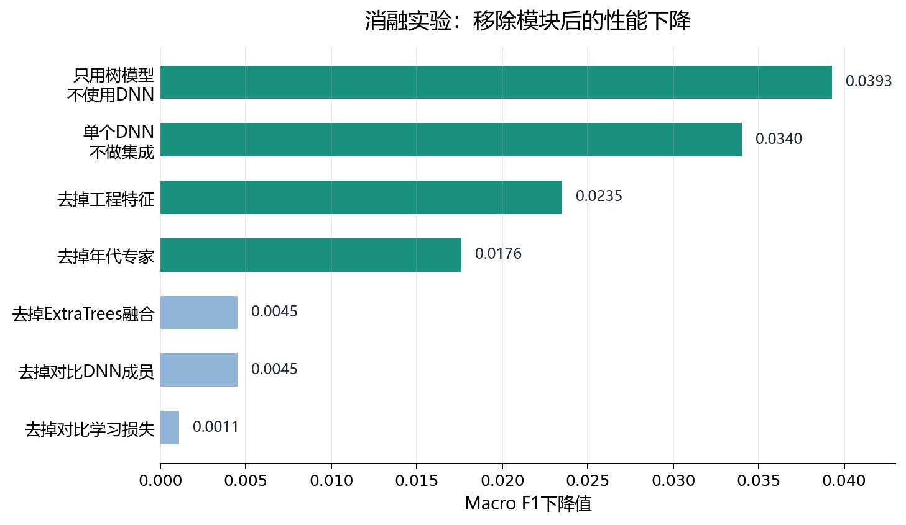

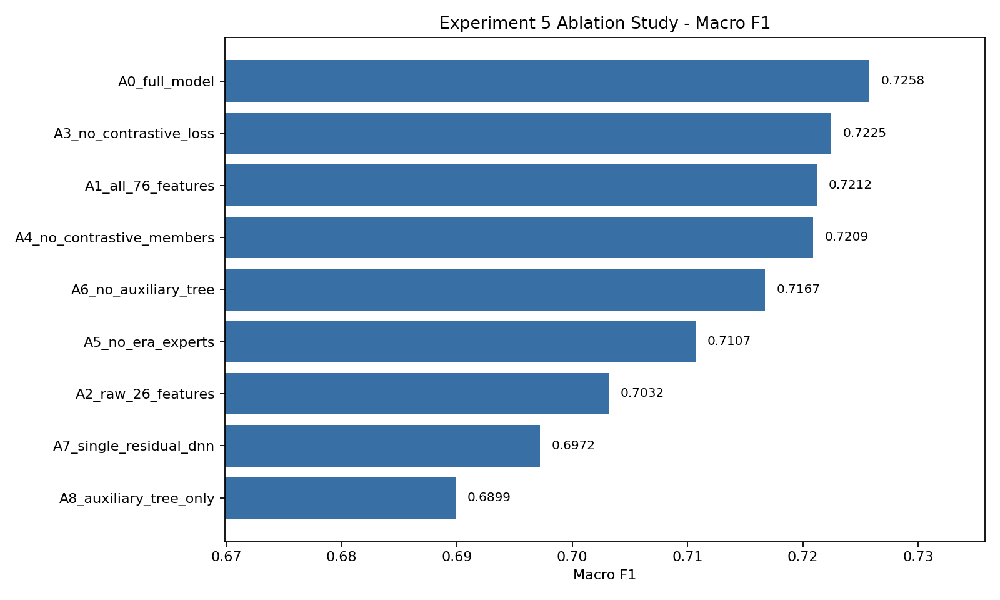

从消融实验看，最终指标不是来自某一个单独技巧，而是多个模块叠加后的结果。DNN 主干和集成学习贡献最大；工程特征让模型看到更直接的位置画像；年代专家处理了 NBA 不同时期打法变化；ExtraTrees 提供了与 DNN 不同的表格模型判断方式；监督对比学习对相邻类别边界有小幅帮助。

按降幅看，影响较大的模块包括 DNN 主干、DNN 集成和工程特征，去掉后 Macro F1 下降在 0.0226 到 0.0359 之间。去掉年代专家下降约 0.0151，去掉 ExtraTrees 融合下降约 0.0091。Contrastive DNN 成员、45维特征筛选和监督对比损失的降幅在 0.0033 到 0.0049 之间；这些结果来自当前缓存的同一测试集，不应单独夸大为稳定的统计显著改进。

做完这一部分后，我对深度学习在表格数据上的认识更具体了。网络层数本身不是关键，真正影响结果的是数据边界是否合规、特征是否能对应任务、训练流程是否可重复、验证集选择是否严格，以及每个模块能不能通过消融实验说清楚。45 维特征筛选的价值不只是指标变化，更重要的是把输入从 76 维压缩到 45 维，减少重复特征，使模型更简洁，也更容易解释。

实验仍有不足。数据中没有身高、体重、臂展、真实上场位置比例等信息，而这些信息对区分 `PF/SF`、`C/PF` 很有帮助；为了保持数据合规，本实验没有引入外部资料。NBA 球员位置本身也会随球队战术变化，一个赛季标签可能无法描述所有比赛中的角色。当前模型虽然做了验证集选择和消融实验，但仍然只是在固定划分上评价，若要进一步确认稳定性，可以增加多次随机划分或交叉验证。ExtraTrees 和 DNN 的融合权重目前是固定权重，后续可以尝试按类别或按置信度动态调整，但这需要更严格的验证设计。

---

# 综合结论

这五个实验按难度逐步展开：贝叶斯用于建立监督分类基线，K-Means 用来观察无监督聚类结构，ID3 和 C4.5 对比了两种单树划分准则，深度学习实验则围绕特征、网络结构和概率融合继续深入。前四个实验保留基础算法版本，便于看到不同算法假设带来的差异；第五个实验在相同任务上做了更完整的模型设计和验证。

各模型的差异比较清楚。贝叶斯训练很快，但条件独立假设不太符合 NBA 技术统计；K-Means 能看出一些技术风格聚集，但无法直接恢复真实位置；ID3 和 C4.5 的规则容易解释，不过离散化和单树结构限制了测试集表现。深度学习模型使用 45 维核心技术特征、Residual DNN、监督对比学习、DNN 集成、年代专家和 ExtraTrees 概率融合，最终在测试集上得到更高的 Accuracy 和 Macro F1。

最终深度学习模型在测试集上达到 `Accuracy = 0.7261`、`Macro F1 = 0.7258`。这个结果没有使用身份信息或数据泄露字段，而是在只使用技术统计及其派生指标的条件下得到的。报告中保留了指标、图表、预测文件和消融实验，便于回看每个模块到底带来了多少变化。

从结果来看，最难的错误仍集中在相邻位置，例如 `PF/SF`、`SF/SG`、`C/PF`。这说明技术统计可以提供较强线索，但无法完全替代比赛语境和角色信息。对我来说，这次实验的收获不只是把指标做高，而是把数据清洗、特征构造、模型选择、评价指标、可视化、消融实验和结果解释串成了一个完整流程。这个过程比单独调用某个模型更接近实际的数据分析任务。
